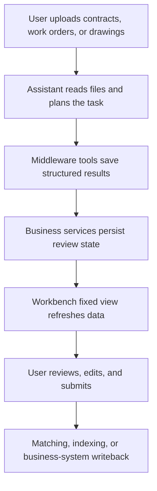

An Agentic App is not just a longer prompt, and it is not finished when a few tools are attached to an agent. A production-ready Agentic App usually combines five parts:

- **[Business plugin](../plugin/develop)**: declares app metadata, configuration, lifecycle hooks, and target product surfaces.
- **[Agent middleware tools](../middleware/custom)**: tools exposed by Agent middleware that turn business actions into schema-driven model calls.
- **Services and data models**: persist structured outputs, review states, source evidence, and execution records.
- **[Workbench view](../../data/features/agent-execution/workbench-and-chatkit)**: gives users a place to review, correct, approve, reject, and submit results.
- **[Assistant template](../agent/ai-assistant/configure-ai-assistant)**: lets business users create a pre-wired assistant with tools, prompts, and runtime settings.

This tutorial uses a BOM Document Intake style business plugin as the reference example and shows how to build a custom Agentic App on the Xpert platform. To make the pattern easy to reuse in your own business domain, the tutorial focuses on key design ideas and code examples instead of concrete source-code locations.

## Related Feature Docs

Use these platform docs alongside this tutorial:

- [Plugin development](../plugin/develop), [plugin concepts](../plugin/concepts), and [plugin schema](../plugin/schema)
- [Agent middleware](../middleware), [custom middleware](../middleware/custom), and the tools exposed by middleware
- [Workbench and ChatKit](../../data/features/agent-execution/workbench-and-chatkit), [ChatKit](../chatkit), and [remote components](../plugin/remote-component)
- [Assistant configuration](../agent/ai-assistant/configure-ai-assistant) and [plugin install/use](../plugin/install)

## Reference Architecture

A BOM Document Intake style plugin turns contract packages, technical agreements, drawings, BOM Excel files, and engineering change documents into structured data that can be reviewed, traced, and matched. Its key pattern is simple: the Agent extracts, compares, and calls tools in batches, while the Workbench handles upload, inspection, confirmation, rejection, and human review.

A typical flow looks like this:



For a new Agentic App, start by separating these responsibilities: what the Agent should automate, what a human must confirm, and what must be persisted with traceable evidence.

## Step 1: Define the Plugin Entry and Target App Capabilities

The [plugin entry](../plugin/develop) declares plugin metadata, config schema, template contributions, and the server module to register.

In the BOM plugin, the `XpertPlugin` entry includes:

- `meta.name`: the plugin package name, such as `@acme/plugin-contract-review`.
- `meta.level`: system, global, or organization scope.
- `meta.targetApps`: the product surfaces where the plugin should appear, such as `data-xpert`.
- `meta.targetAppMeta["data-xpert"].types`: app-specific business types, such as `workbench-view`, `assistant-tool`, and `business-app`.
- `meta.targetAppMeta["data-xpert"].capabilities`: business capabilities used by plugin centers, templates, and governance rules.
- `config.schema` and `config.formSchema`: runtime validation and optional frontend configuration.
- `templates`: assistant templates contributed by the plugin.

A simplified pattern:

```ts
import { z } from 'zod'
import type { XpertPlugin } from '@xpert-ai/plugin-sdk'
import { MyAgenticAppPlugin } from './lib/my-agentic-app.plugin'

const ConfigSchema = z.object({
  defaultKnowledgebaseId: z.string().optional()
})

const plugin: XpertPlugin<z.infer<typeof ConfigSchema>> = {
  meta: {
    name: '@acme/plugin-contract-review',
    version: '0.1.0',
    level: 'system',
    category: 'middleware',
    targetApps: ['data-xpert'],
    targetAppMeta: {
      'data-xpert': {
        types: ['workbench-view', 'assistant-tool', 'business-app'],
        capabilities: ['contract-review', 'review-workbench']
      }
    },
    displayName: 'Contract Review',
    description: 'Parse contracts and expose a review workbench.',
    author: 'Acme'
  },
  config: {
    schema: ConfigSchema
  },
  templates: [],
  register() {
    return { module: MyAgenticAppPlugin, global: true }
  }
}

export default plugin
```

Design guidance:

- Treat `targetAppMeta` as the capability contract for the upper-level app. Do not hide business capabilities only in description text.
- To show the plugin in the data-xpert plugin center, declare `targetApps: ['data-xpert']` and non-empty `targetAppMeta["data-xpert"].types`.
- Keep config for values that really need deployment-time or admin control, such as default resource IDs, retrieval modes, or external service endpoints.

## Step 2: Register Server Modules, Entities, and Lifecycle Hooks

Server modules are registered with `@XpertServerPlugin`; see [plugin concepts](../plugin/concepts) for the surrounding model. A BOM-style plugin registers TypeORM entities, business services, [Agent middleware](../middleware), and a Workbench view provider in its server module.

An Agentic App usually needs at least three provider categories:

- **Business services**: save, query, review, match, submit, or write back business data.
- **Agent middleware**: convert selected business actions into middleware tools.
- **View provider**: expose data and actions to Workbench.

A simplified module:

```ts
import { TypeOrmModule } from '@nestjs/typeorm'
import { XpertServerPlugin } from '@xpert-ai/plugin-sdk'
import { ContractReviewMiddleware } from './contract-review.middleware'
import { ContractReviewService } from './contract-review.service'
import { ContractReviewViewProvider } from './contract-review-view.provider'
import { ContractDocument, ContractLine } from './entities'

const ENTITIES = [ContractDocument, ContractLine]

@XpertServerPlugin({
  imports: [TypeOrmModule.forFeature(ENTITIES)],
  entities: ENTITIES,
  providers: [
    ContractReviewService,
    ContractReviewMiddleware,
    ContractReviewViewProvider
  ],
  exports: [ContractReviewService]
})
export class ContractReviewPlugin {}
```

Do not design the data model only around a successful tool call. A reviewable Agentic App often needs to persist:

- Source evidence, file names, page numbers, and confidence.
- Agent judgments, human review status, and review comments.
- Failure reasons and retry jobs.
- Matching records for external systems or knowledge bases.

The BOM plugin follows this pattern for contract product lines, technical attributes, technical differences, BOM matching results, and reparse jobs.

## Step 3: Expose Business Actions as Agent Middleware Tools

[Agent middleware](../middleware/custom) is the automation entry point of an Agentic App. In this tutorial, "tools" means callable tools returned by middleware to the agent runtime. The BOM plugin does not expose one giant "parse contract" tool. Instead, it uses an ordered middleware tool sequence:

```text
bom_upsert_parsed_contract
  -> bom_upsert_contract_product_line
  -> bom_finalize_parsed_contract
```

This shape matters. The Agent saves the contract header first, then saves each product line with technical attributes and differences, and finally marks parsing complete. Long document work can be persisted in batches, and partial progress remains traceable if the run fails midway.

When designing your own tools:

- Keep each tool focused on one business action.
- Use zod schemas for inputs, and describe when to call the tool, how to call it, and which fields are required.
- Put call order and boundary conditions in the tool description.
- For long lists, save one item at a time instead of submitting a huge array.
- Provide a failure-reporting tool so the Agent can end incomplete work explicitly.

A simplified tool:

```ts
const saveContractHeaderTool = tool(
  async (input) => {
    const contract = await service.upsertContractHeader(input)
    return JSON.stringify({
      message: 'Contract header was saved. Next save one line at a time.',
      contractId: contract.id,
      status: contract.status
    })
  },
  {
    name: 'contract_upsert_header',
    description:
      'Create or reset the parsed contract header. Call this before saving line items.',
    schema: contractHeaderSchema
  }
)
```

For document-intake apps, encode evidence requirements in schemas and tool descriptions. The BOM plugin expects important technical attributes to include `sourceRole`, `sourceDocumentName`, `page`, `evidenceText`, and `confidence`, so reviewers can trace each judgment back to the original document.

## Step 4: Create the Workbench Review UI

A real business app should not leave results only in chat. Users need a [Workbench surface](../../data/features/agent-execution/workbench-and-chatkit) for lists, filters, source files, field edits, difference review, and final submission.

A BOM-style plugin registers a fixed view, such as `BOM Review`, through a view provider. For iframe-based plugin UI, see [remote components](../plugin/remote-component). Its manifest declares:

- View placement: Agent Workbench main slot or fixed slot.
- Rendering mode: `remote_component + react + iframe`.
- Query capabilities: pagination, search, sort, and parameters.
- Actions: JSON actions, file actions, row actions, and toolbar actions.
- Host event subscriptions: listen for Assistant tool completion and forward events to the iframe.

A simplified manifest:

```ts
{
  key: 'contract_review',
  title: { en_US: 'Contract Review', zh_Hans: '合同审核' },
  hostType: 'agent',
  view: {
    type: 'remote_component',
    runtime: 'react',
    protocolVersion: 1,
    component: {
      isolation: 'iframe',
      entry: 'contract-review'
    },
    dataSource: {
      mode: 'platform'
    }
  },
  actions: [
    {
      key: 'approve_line',
      label: { en_US: 'Approve', zh_Hans: '确认' },
      actionType: 'invoke',
      placement: 'row'
    }
  ]
}
```

The key Workbench rule is that the iframe does not receive tokens and does not call host APIs directly. It uses a controlled `postMessage` bridge to request data and execute actions. The platform API then resolves the assistant, organization, tenant, and permissions before forwarding to the view-host.

## Step 5: Refresh Views from Tool Completion Events

An Agentic App should feel continuous: the user asks the Assistant to parse a contract, tools finish, and the review workbench moves to the right tab with fresh data.

The BOM plugin uses `hostEvents.subscriptions` in the manifest to listen for tool completion. For the Workbench and ChatKit event flow, see [Workbench and ChatKit](../../data/features/agent-execution/workbench-and-chatkit):

```ts
hostEvents: {
  subscriptions: [
    {
      key: 'contract-review-tool-completed',
      event: 'assistant.tool.completed',
      filter: {
        sources: ['chatkit'],
        toolNames: ['contract_upsert_header', 'contract_save_line']
      },
      action: {
        type: 'forward',
        debounceMs: 1000
      }
    }
  ]
}
```

Recommended behavior:

- Declarative views can use `refresh`.
- Iframe remote components should usually use `forward`, then let the iframe decide whether to switch tabs, refresh part of the data, or update query parameters based on `toolName` and output.
- Do not hard-code a plugin's tool names or view keys in the data-xpert Workbench host. The plugin manifest should declare them.
- Forwarded events must not include tokens, API URLs, assistant IDs, tenant IDs, organization IDs, or other sensitive host context.

## Step 6: Provide an Assistant Template

Business users should not manually wire middleware, model parameters, and prompts. An Agentic App should contribute an Assistant template; see [Assistant configuration](../agent/ai-assistant/configure-ai-assistant) for the standard assistant setup flow.

A BOM-style plugin exposes Assistant templates through template contribution code and loads DSL content for the assistant. The template declares:

- `type: Agent`
- `targetApps: ['data-xpert']`
- `requiredPlugins`
- `capabilities`
- default business domain and manager
- starter prompts
- DSL nodes for the agent, middleware, toolsets, state variables, and model options

A simplified template:

```ts
export const templates = [
  {
    key: 'contract-review-assistant',
    title: 'Contract Review Assistant',
    type: XpertTypeEnum.Agent,
    targetApps: ['data-xpert'],
    targetAppMeta: {
      'data-xpert': {
        types: ['business-assistant'],
        capabilities: ['contract-review', 'review-workbench'],
        requiredPlugins: ['@acme/plugin-contract-review']
      }
    },
    dslContent,
    startPrompts: [
      'Parse this contract package and save the header, lines, and differences.',
      'Re-analyze this contract and preserve source evidence.'
    ]
  }
]
```

The template prompt should tell the Assistant:

- Its business role.
- Which tools can be used for which tasks.
- When files or images must be inspected first.
- Which fields require evidence and confidence.
- Which failure tool or fallback output to use when the task cannot be completed.

## Step 7: Develop, Build, and Register from an Independent Plugin Repository

Production business plugins should be developed in an independent plugin repository, often with a workspace layout similar to `xpert-plugins`. The Xpert host should load, validate, and run plugins; production plugin code should not be developed directly inside the host application repository. For install and use flows, see [plugin install/use](../plugin/install).

At minimum, each plugin package should declare its package name, build entry, and SDK peer dependency:

```json
{
  "name": "@acme/plugin-contract-review",
  "version": "0.1.0",
  "main": "dist/index.cjs.js",
  "types": "dist/index.d.ts",
  "peerDependencies": {
    "@xpert-ai/plugin-sdk": "^3.8.0"
  }
}
```

Recommended development workflow:

```bash
pnpm install
pnpm nx build plugin-contract-review
```

The build output should include the plugin entry, type declarations, runtime code, and remote component assets. During development, connect the independent plugin repository to a Xpert instance for integration testing. Before starting the host API, explicitly allow the workspace root that contains the plugin repository:

```bash
export PLUGIN_WORKSPACE_ROOTS="/abs/path/to/xpert-plugins"
```

Then register the independent plugin package into the current organization through the plugin install API or the project's install helper script:

```bash
pnpm plugin:install:local \
  --workspace-path /abs/path/to/xpert-plugins/acme/contract-review \
  --org-id <your-org-id> \
  --token <your-token>
```

After code changes, rebuild the plugin package and reinstall or reload it. This keeps the host application and plugin repository from sharing duplicated runtime dependencies accidentally.

For production delivery, there are usually two paths:

- **Independent release**: publish the plugin as an npm package or internal enterprise artifact, then load it through the platform plugin installation flow.
- **Built-in product plugin**: only platform-owned system plugins should be added to the host's default plugin list and deployment package manifests.

In both cases, keep `@xpert-ai/plugin-sdk` as a peer dependency so the plugin does not bundle its own SDK copy.

## Step 8: Test and Accept the App

Cover at least these scenarios:

- Plugin lifecycle: loading, start, stop, and no duplicated SDK runtime through dependencies.
- Config schema: defaults, form fields, and invalid config validation.
- Tool schema: required fields, invalid inputs, call order, and failure reporting.
- Business services: save, replace, paginate, state transitions, and source evidence retention.
- Workbench manifest: fixed entry, actions, file actions, and host events.
- Remote component: iframe initialization, data loading, action execution, and tool-completion refresh.
- Assistant template: correct middleware, prompt, model options, and starter prompts after creation.
- End-to-end flow: user uploads a document, Assistant saves structured results through tools, Workbench refreshes, and a human submits the reviewed output.

For BOM-style document-intake apps, also check:

- Every business line has a stable line number.
- Every important field has source evidence.
- The Agent does not invent missing values; uncertain cases become pending differences or review suggestions.
- Long documents can be saved in batches and finally marked as completed or failed.

## Reusable Design Checklist

Use this checklist when building a new Agentic App:

| Design area | Question |
| --- | --- |
| Business loop | What does the Agent automate, what does a human review, and what does the system persist? |
| Plugin manifest | Are `targetApps`, `targetAppMeta`, types, and capabilities declared? |
| Data model | Are evidence, confidence, review status, and failure reasons persisted? |
| Agent middleware tools | Are schemas, call order, per-item saves, and failure reporting defined? |
| Workbench view | Are list, detail, edit, approve, submit, and file preview flows available? |
| Event refresh | Does the view refresh into the right context after tool completion? |
| Assistant template | Can users create a fully wired business assistant in one step? |
| Tests | Do tests cover tools, services, views, templates, and the end-to-end flow? |

When these questions have clear answers, your custom Agentic App is no longer just an agent configuration. It becomes an installable, governable, reusable, and continuously improvable business application on the Xpert platform.
