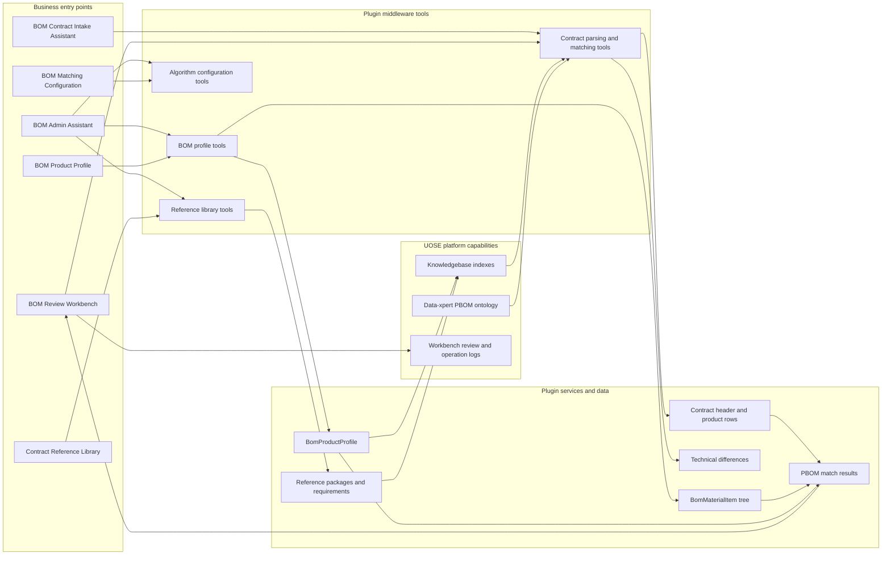
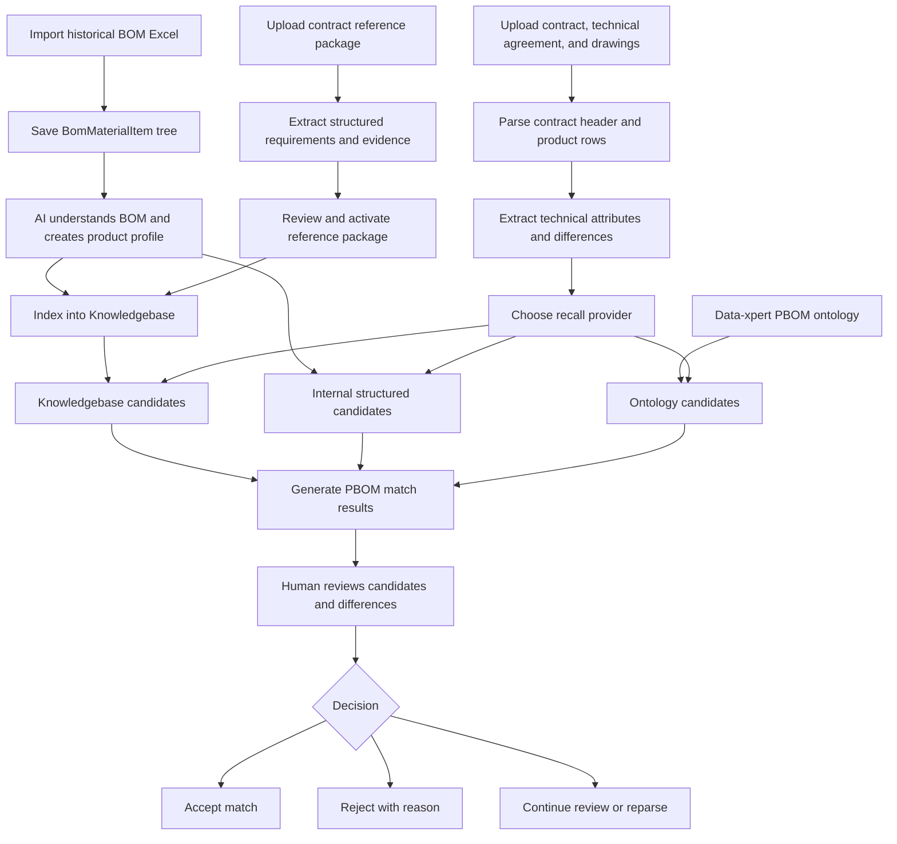

Contract BOM Intelligent Assistant is an official UOSE business App for contract package intake, BOM product profile maintenance, reusable reference libraries, and PBOM match review in manufacturing scenarios such as electric motors. It connects Assistant extraction, UOSE Knowledgebase, ontology resources, and Agent Workbench review views into an auditable business loop.

## When To Use It

- Sales contracts, technical agreements, drawings, and project packages need to become structured contract data.
- Contract product rows need to be matched to imported PBOM roots with similarity, confidence, and explainable differences.
- Technical agreements, project standards, drawings, datasheets, and certificates need to be stored for repeated use.
- BOM Excel files need to be imported as trees and maintained as reusable product profiles.
- Business users need to confirm technical differences, accept matches, or reject unsuitable candidates.

## Plugin URL

Marketplace: [Contract BOM Intelligent Assistant](https://data.xpertai.cn/plugins/%40xpert-ai%2Fplugin-bom-document-intake)

## What The App Adds

After an administrator enables the App from the marketplace, UOSE / Data-xpert receives these capabilities:

| Type | Name | Purpose |
| --- | --- | --- |
| Workbench view | BOM Review Workbench | Review parsed contracts, run BOM matching, and inspect candidates and differences. |
| Workbench view | BOM Product Profile | Upload BOM Excel files, preview and import BOM trees, and maintain product profiles. |
| Workbench view | Contract Reference Library | Manage reusable reference packages, structured requirements, evidence, and Knowledgebase indexes. |
| Workbench view | BOM Matching Configuration | Manage matching algorithms, recall providers, and scoring weights. |
| Assistant template | BOM Contract Intake Assistant | Parse contract packages, save contract headers and product rows, analyze technical differences, and run PBOM matching. |
| Assistant template | BOM Admin Assistant | Maintain reference libraries, product profiles, Knowledgebase indexes, and algorithm configuration. |

## Recommended Roles

| Role | Recommended Entry | Main Responsibility |
| --- | --- | --- |
| Contract user | BOM Review Workbench, BOM Contract Intake Assistant | Upload contract packages, review contract data and technical differences, and run PBOM matching. |
| BOM/profile admin | BOM Product Profile, BOM Admin Assistant | Import BOM Excel files, maintain manual or AI-understood product profiles, and rebuild BOM Knowledgebase indexes. |
| Reference library admin | Contract Reference Library, BOM Admin Assistant | Intake document packages, review structured requirements, activate packages, and rebuild indexes. |
| Algorithm admin | BOM Matching Configuration | Tune recall, scoring, and confidence-related settings. |

## System Architecture

Contract BOM Intelligent Assistant connects Workbench views, Assistant templates, plugin middleware, business data, and UOSE platform capabilities. Workbench handles upload, review, confirmation, and configuration; Assistants read files, extract facts, compare differences, and call tools; plugin services persist data, build indexes, and run matching.



## End-To-End Flow

In code, this App is not just a document parser. It first turns historical PBOMs, reference materials, and new contract packages into reviewable data, then runs candidate recall, difference explanation, and human confirmation.



## Before You Start

Prepare these items before using the App:

- A UOSE workspace where Contract BOM Intelligent Assistant is enabled.
- At least one Knowledgebase for BOM or reference-library indexing.
- Historical BOM Excel files in `.xlsx` or `.xls` format.
- Contract packages such as sales contracts, technical agreements, drawings, datasheets, checklists, or archives.
- If ontology recall is required, a Data-xpert PBOM resourceId, or a current PBOM snapshot that the system can search.

## Recommended Flow

### 1. Import BOMs and maintain product profiles

Open **BOM Product Profile** and use the **BOM Maintenance** tab to upload a BOM Excel file. Preview the result before import, then confirm the root material, tree structure, warnings, and replacement scope.

After import, the App stores a tree of `BomMaterialItem` records. For PBOM roots that should be reused in future matching, trigger **AI Understand BOM** so the Assistant can write a unified `BomProductProfile`. The profile captures fields such as model, frame size, power, poles, voltage, protection grade, terminal box direction, protocol features, and component facts.

When Knowledgebase recall is needed, choose a target Knowledgebase and run **Index BOM Knowledgebase**. The App cleans old chunks by stable `writeKey` before writing new ones, so repeated indexing does not accumulate duplicate chunks for the same BOM root.

### 2. Build a reusable contract reference library

Open **Contract Reference Library**, create a package, and upload a zip, PDF, Word, Excel, image, or drawing file. Zip files are expanded and sent through the Knowledgebase parsing pipeline.

Then use **BOM Admin Assistant** to extract structured requirements from original Knowledgebase chunks. Each requirement should keep source file, page or location, evidence text, applicability, and confidence. After administrator review, mark the package as `active` and rebuild the reference-library Knowledgebase index.

The reference library is intended for stable long-term requirements such as technical agreement clauses, project standards, drawing constraints, certificates, inspection rules, and delivery requirements. Session-level file understanding can help with evidence, but it does not replace the long-term reference library.

### 3. Parse a contract package

Create or open **BOM Contract Intake Assistant**, then upload the contract, technical agreement, drawings, and related files. A typical prompt is:

```text
Please parse this contract package and save the contract header, product rows, and technical differences.
```

The Assistant saves the contract header first, then saves product rows one at a time. Each row should include `technicalAttributes` and `technicalDifferences`; when no attributes or differences are found, the Assistant should still save empty arrays explicitly. After all rows are saved, the Assistant finalizes the contract, and it appears in the **Contract Data** and **BOM Matching** tabs.

### 4. Review contract data and technical differences

Open the **Contract Data** tab in **BOM Review Workbench** and review the contract header, source documents, product rows, structured technical attributes, and difference judgments.

Common technical difference types include:

| Type | Meaning |
| --- | --- |
| `value_conflict` | The contract remark and technical agreement or drawing provide conflicting values for the same attribute. |
| `missing_in_remark` | The technical agreement or drawing has a requirement that is missing from the contract remark. |
| `missing_in_agreement` | The contract remark has a requirement that cannot be found in the technical agreement or drawing. |
| `scope_ambiguous` | The applicable product-line scope is unclear. |
| `source_uncertain` | The source or confidence is insufficient and needs human review. |

Users can mark each difference as confirmed, ignored, needs correction, or pending. When reparsing a contract, keep the same contract number or contract ID so old results can be replaced within the same review loop.

### 5. Run PBOM matching

Open the **BOM Matching** tab, select a finalized contract, recall provider, Knowledgebase, and candidate count, then run matching.

Available recall providers:

| Provider | When To Use |
| --- | --- |
| `internal` | Use only structured fields and component facts from imported BOMs. |
| `knowledgebase` | Recall from BOM root chunks in Knowledgebase. |
| `ontology` | Use Data-xpert PBOM ontology candidates. |
| `dual` | Merge internal and Knowledgebase recall. |
| `multi` | Merge internal, Knowledgebase, and ontology recall. |

The result shows the recommended BOM, top candidates, similarity, confidence, specification differences, missing protocol features, missing or conflicting components, and recall trace. Confidence above `0.85` is usually a strong recommendation; `0.70 - 0.85` should be reviewed; below `0.70` should not be assigned automatically.

### 6. Review and write back decisions

Inspect the recall process, matched documents, mapping method, and difference explanation in candidate details. Accept a match when it is correct, reject unsuitable candidates with a reason, or ask the Assistant to continue reviewing and save an AI review when evidence is insufficient.

## Evidence And Data Quality

- Important fields should include evidence such as file name, page, clause, table location, or drawing zone.
- Contract parsing should save contract facts and Agent judgments, not unsupported guesses.
- `BomProductProfile` is the reusable product-profile layer; it does not replace the original BOM Excel data.
- Structured reference-library requirements should be administrator-reviewed before they are used as default comparison evidence.
- Knowledgebase indexes are rebuildable retrieval layers, not authoritative business tables. When a BOM root or reference package is deleted, the App cleans stable chunks that it wrote.

## Troubleshooting

### A contract does not appear in BOM Matching

Make sure the Assistant finalized the contract. A contract with only a header or partial product rows is not available for matching.

### Match confidence is low

Common causes include missing contract fields, weak BOM product profiles, missing Knowledgebase indexes, or a recall provider that is too narrow. Improve contract technical attributes and BOM profiles, then retry with `dual` or `multi` recall.

### Reference-library requirements are not used

Check that the package is `active`, the structured requirements are `confirmed` or `active`, and the reference-library index has been rebuilt.

### Old results still appear after deleting a BOM

The App cleans chunks it wrote with the `bom-product-profile:v2:{rootId}:` prefix. If old results come from manually uploaded documents or another App, maintain them in the corresponding Knowledgebase.

## Best Practices

- Import and profile high-frequency historical BOMs before processing new contract packages.
- Put long-term reusable materials into the reference library instead of relying only on temporary uploads.
- Let the Assistant save one contract row at a time so attributes, differences, and evidence stay reviewable.
- Keep human decisions and reasons for low-confidence matches; they help improve profiles and matching configuration later.
- Rebuild BOM and reference-library indexes after updating BOM Excel files, product profiles, or package requirements.
