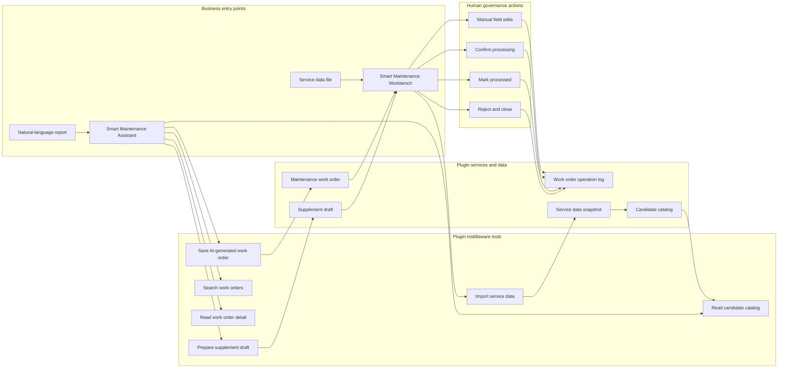
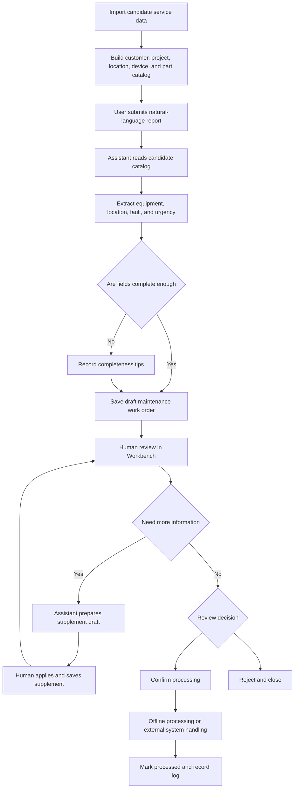

Smart Maintenance is a community Plugin App for AI-assisted maintenance intake. It turns natural-language repair reports into reviewable maintenance work orders, supports candidate service-data import, and keeps business-critical processing actions inside Workbench for human review.

## When To Use It

- Production equipment, facility, after-sales, or field-service issues need to be registered quickly.
- Users describe a fault in natural language, and an Assistant should extract equipment, location, fault type, urgency, and initial diagnosis.
- Candidate data such as device types, fault categories, departments, roles, parts, and locations needs to be imported for normalized Assistant use.
- Maintenance supervisors need to supplement, confirm, reject, or close work orders from a review desk.

The first version focuses on an Xpert-side demo loop. It does not directly implement CMMS, FSM, ERP, dispatching, inventory, notifications, attachments, or SLA integration.

## Plugin URL

Marketplace: [Smart Maintenance](https://data.xpertai.cn/plugins/%40xpert-ai%2Fplugin-smart-maintenance)

## What The App Adds

| Type | Name | Purpose |
| --- | --- | --- |
| Workbench view | Smart Maintenance Workbench | Import service data, submit repair reports, and review maintenance work orders. |
| Assistant template | Smart Maintenance Assistant | Generate draft work orders, query work orders, and prepare supplement drafts. |
| Assistant tools | Smart Maintenance Tools | Save AI-generated work orders, import service data, read catalog candidates, query work orders, and prepare supplement drafts. |

## Recommended Roles

| Role | Main Responsibility |
| --- | --- |
| Intake user | Submit repair descriptions and let the Assistant create draft work orders. |
| Maintenance supervisor | Review fields, supplement details, confirm processing, or reject and close work orders. |
| Service-data admin | Import customers, projects, locations, devices, departments, roles, and parts. |

## System Architecture

Smart Maintenance separates natural-language reports, candidate service data, AI-generated work orders, and human review actions. Assistant tools save draft data and query information, while Workbench view actions own all governed human state transitions.



## Processing Flow

The first version centers on an "AI-generated draft work order + human governance loop". Imported service data improves field normalization. If fields are incomplete, the Assistant records completeness tips or supplement drafts instead of inventing missing facts.



## Recommended Flow

### 1. Import candidate service data

Upload a service-data file in Workbench, prepare a draft payload, then let the Assistant call `smart_maintenance_import_service_data` to persist it. The catalog helps normalize device types, locations, departments, roles, parts, and fault categories.

If no service data has been imported, the App falls back to a built-in mock catalog for demos and early validation.

### 2. Generate a reviewable work order

Open **Smart Maintenance Assistant** and describe the issue, for example:

```text
The air compressor in Workshop 3 has abnormal noise and rising temperature this morning. Please create a maintenance work order.
```

The Assistant extracts structured fields and calls `smart_maintenance_save_generated_work_order` to save a draft work order. When fields are incomplete, it should record completeness tips instead of inventing device numbers, contacts, occurrence time, or location.

### 3. Review in Workbench

Open **Smart Maintenance Workbench** to review work-order details. Users can edit title, equipment, location, fault category, urgency, description, AI diagnosis, and suggested actions.

Confirm processing, mark processed, and reject/close actions are Workbench-only actions, not Agent tools. This prevents the Assistant from claiming that a job has been dispatched, repaired, or closed.

### 4. Supplement and query work orders

When users provide additional information, the Assistant can call `smart_maintenance_prepare_supplement_draft` to save a supplement draft. Reviewers can then apply and save it manually in Workbench. For list and detail queries, the Assistant can use `smart_maintenance_search_work_orders` and `smart_maintenance_get_work_order_detail`.

## Tool Boundaries

| Tool | Purpose |
| --- | --- |
| `smart_maintenance_save_generated_work_order` | Save a draft maintenance work order from a natural-language report. |
| `smart_maintenance_import_service_data` | Persist a candidate service-data snapshot. |
| `smart_maintenance_get_catalog` | Read candidate devices, faults, locations, departments, roles, and parts. |
| `smart_maintenance_search_work_orders` | Search work orders by status, keyword, device type, and urgency. |
| `smart_maintenance_get_work_order_detail` | Read one work order and its operation log. |
| `smart_maintenance_prepare_supplement_draft` | Prepare an AI supplement draft from user-provided details. |

## Data Quality

- AI diagnosis is preliminary and should keep a field-verification tone.
- Missing fields should be recorded in `completenessTips`, not guessed.
- One report should usually create one work order; multi-device or multi-fault descriptions should be marked as multiple issues.
- Confirmation, closure, and processing results require human action in Workbench.
- Operation logs should preserve AI creation, manual edits, supplements, confirmation, completion, and rejection events.

## Troubleshooting

### Why can't the Assistant close a work order directly?

Closure is a governed human action. The App keeps confirm, process, and reject/close actions in Workbench view actions so the Agent cannot overstep business state transitions.

### Candidate devices or departments are inaccurate

Update and re-import the service-data file. The Assistant reads the current catalog; without imported data it only uses the demo mock catalog.

### Can this connect to a real maintenance system?

This community App is a demo-ready loop. Production CMMS, FSM, ERP, inventory, notification, or SLA integration requires additional configuration, permissions, external APIs, state mapping, and audit design.
