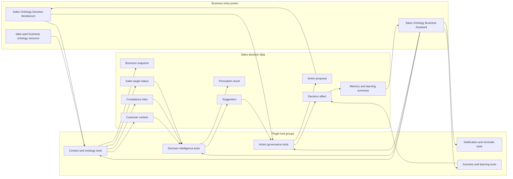
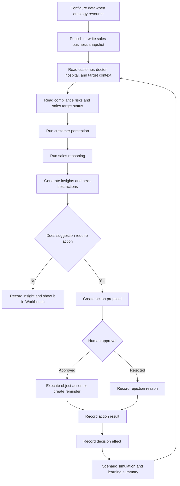

Sales Ontology is a community Plugin App for sales decision intelligence. It uses data-xpert business ontology to organize customers, doctors, hospitals, targets, compliance alerts, suggestions, and action proposals into a perception, reasoning, governance, and learning loop.

## When To Use It

- Sales teams need a unified business ontology for customers, hospitals, doctors, products, targets, and compliance signals.
- Managers want perception runs that detect prescription decline, target risk, or compliance anomalies.
- Assistants need to generate next-best-action suggestions and submit high-risk actions for approval.
- Teams need to record action results, decision effects, scenario simulations, and learning summaries.

## Plugin URL

Marketplace: [Sales Ontology](https://data.xpertai.cn/plugins/%40xpert-ai%2Fplugin-sales-ontology)

## What The App Adds

| Type | Name | Purpose |
| --- | --- | --- |
| Workbench view | Sales Ontology Decision Workbench | Review perceptions, suggestions, action proposals, notifications, reminders, scenarios, and decision effects. |
| Assistant template | Sales Ontology Business Assistant | Read sales ontology context, run perception and reasoning, generate suggestions, and govern actions. |
| Business ontology capability | Sales Ontology business ontology | Publish and query sales business objects, relations, insights, suggestions, and action facts. |
| Assistant tools | Sales Ontology Tools | Cover context reading, decision intelligence, action governance, scenario simulation, and learning summaries. |

## System Architecture

Sales Ontology uses data-xpert business ontology as the semantic foundation for sales objects and relationships, then exposes perception, reasoning, suggestion, action governance, and learning loops through plugin tools. High-risk actions first become proposals and are approved or executed from Workbench.



## Decision Loop

The main loop is "ontology context -> perception and reasoning -> suggestion generation -> action proposal -> human governance -> effect learning". It makes the sales decision process explicit instead of letting the Assistant bypass approvals for high-risk actions.



## Recommended Flow

### 1. Configure ontology resources

Administrators configure the data-xpert API base URL and default ontology resource ID. The App can use the default `sales-ontology` resource or point to an organization-specific business ontology resource.

### 2. Publish a business snapshot

Use Workbench or Assistant tools to publish sales business snapshots that include customers, doctors, hospitals, targets, compliance alerts, action definitions, suggestions, and outcomes. Demo environments can seed Workbench records quickly with built-in demo data.

### 3. Run perception, reasoning, and suggestions

The Assistant can read customer context, compliance risks, and target status, then run perception and reasoning before generating insights and suggestions. Example prompt:

```text
Read customers and sales targets from Sales Ontology, run perception, and summarize risks.
```

Typical outputs include high-influence low-conversion customers, sales targets below plan, expenses near compliance thresholds, churn risk, and recommended follow-up visits.

### 4. Govern action proposals

For business actions that may execute or write back, the Assistant first creates an action proposal. Managers can approve, reject, or execute proposals in Workbench and record results. Actions that require approval should not bypass governance.

### 5. Simulate scenarios and learn

The App supports scenario simulation, decision-effect recording, memory, and learning summaries. Managers can compare predicted effects of resource reallocation, product mix optimization, churn intervention, or compliance risk response.

## Tool Scope

| Tool Group | Representative Capabilities |
| --- | --- |
| Context and ontology | Publish business snapshots, read domain ontology, customer context, compliance risks, and sales target status. |
| Decision intelligence | Run perception, reasoning, insight generation, and next-best-action suggestions. |
| Action governance | Create action proposals, execute object actions, create visit records, update sentiment, and flag compliance risks. |
| Notifications and reminders | Send notifications and create follow-up reminders. |
| Scenario and learning | Simulate scenarios, record decision effects, read effect rollups, record memory, and generate learning summaries. |

## Typical Questions

- Which high-value customers have declining conversion and should be visited first?
- Is current sales target achievement below plan, and where does the risk come from?
- Which compliance alerts require escalation or human review?
- What is the predicted effect of adjusting budget, channels, or KOL investment?
- Does a suggestion require approval, and how should the result be recorded?

## Governance Boundaries

- Ontology snapshots and action facts should include source and business context, not temporary guesses as durable facts.
- Compliance, expense, access, and customer-state changes should go through proposals and approvals.
- Workbench is the human governance entry; the Assistant generates suggestions and drafts, but should not bypass approval.
- Decision effects and learning summaries improve future suggestions, but do not replace business-owner judgment.
