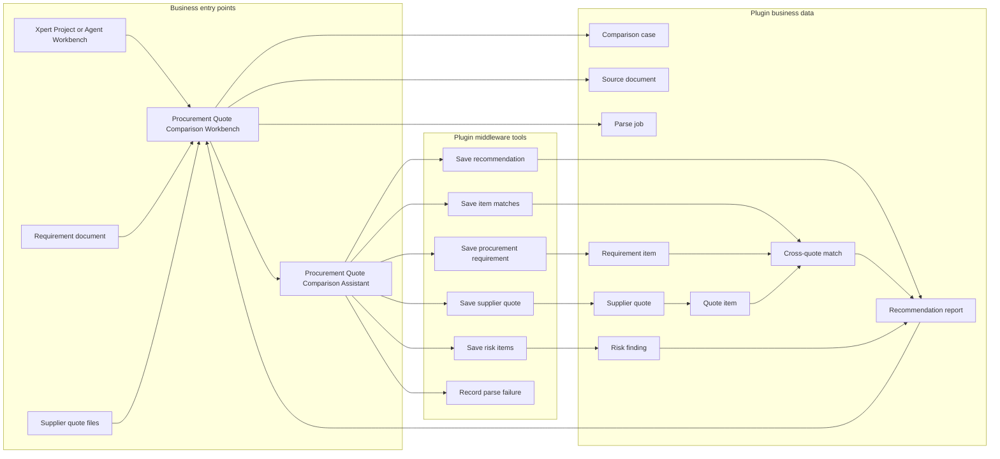
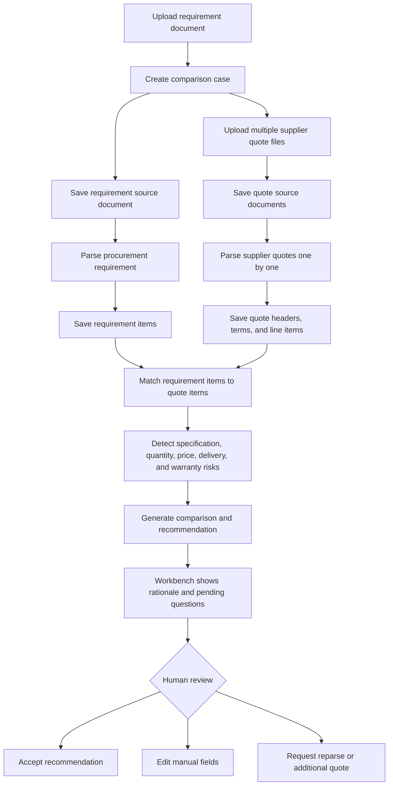

Procurement Quote Comparison is a community Plugin App for AI-assisted procurement comparison. It supports enterprise purchasing, administrative purchasing, IT procurement, and finance shared-service scenarios. Users create a comparison case in Xpert Project or Agent Workbench, let an Assistant parse requirement and supplier quote documents, and review structured results, risks, and recommendations.

## When To Use It

- Procurement users need to compare multiple supplier quotes with inconsistent file formats.
- Requirement documents contain items, specifications, quantity, budget, and expected delivery dates.
- Supplier quotes need structured supplier, contact, tax, delivery, payment, warranty, and line-item data.
- Users need to detect specification mismatch, quantity mismatch, missing quotes, delivery risk, warranty risk, and price anomalies.
- Users need explainable answers to questions such as "why not choose the lowest price?"

## Plugin URL

Marketplace: [Procurement Quote Comparison](https://data.xpertai.cn/plugins/%40xpert-ai%2Fplugin-procurement-quote-comparison)

## What The App Adds

| Type | Name | Purpose |
| --- | --- | --- |
| Project / Agent Workbench view | Procurement Quote Comparison Workbench | Manage comparison cases, upload documents, trigger parsing, and review comparison results and AI recommendations. |
| Assistant template | Procurement Quote Comparison Assistant | Parse requirements and supplier quotes, generate item comparisons, risk findings, and recommendation reports. |
| Assistant tools | Procurement Quote Comparison Tools | Save requirement parsing, quote parsing, item matches, risk items, final recommendations, and parse failures. |

## System Architecture

Procurement Quote Comparison uses a comparison case as the business boundary. Workbench stores requirement and supplier quote file handles, the Assistant reads one file at a time and calls middleware tools, and plugin services write requirements, quotes, matches, risks, and recommendations back to the same case.

## Comparison Flow

The App parses each supplier quote as a separate source document so multiple quotes do not contaminate each other in one Assistant message. The final recommendation is not just the lowest price; it also weighs specification fit, quantity, tax, delivery, warranty, payment terms, and risk findings.

## Recommended Flow

### 1. Create a comparison case

Open the procurement comparison entry in Xpert Project or Agent Workbench and upload a requirement document. The App creates a comparison case from the file and stores the platform file handle so the original file can be attached to Assistant parsing messages.

Manual case creation is also available, but starting from the requirement document is the recommended path.

### 2. Upload supplier quote files

Open the case detail and upload quotes from at least two suppliers. Each quote is saved as a separate source document. During batch parsing, each Assistant message attaches only one supplier quote file, preventing data from different suppliers from contaminating one another.

### 3. Parse requirements and quotes

Select an Xpert with procurement comparison middleware and trigger:

1. Requirement parsing.
2. Supplier quote batch parsing.
3. Comparison result generation.

The Assistant calls `procurement_save_requirement` to save requirement fields and item rows, then `procurement_save_supplier_quote` to save supplier quote headers, terms, and line items.

### 4. Generate comparison and recommendation

After parsing, the Assistant matches supplier quote items to requirement items, then saves item matches, risks, and final recommendations. The workbench shows requirements, supplier quotes, comparison tables, risk findings, recommended supplier, recommendation rationale, report draft, and pending questions.

When AI fields conflict with manually maintained fields, the App preserves manual values and records the conflict as a pending difference.

## Tool Boundaries

| Tool | Purpose |
| --- | --- |
| `procurement_save_requirement` | Save procurement project fields and requirement line items. |
| `procurement_save_supplier_quote` | Save supplier quote headers, commercial terms, and quote line items. |
| `procurement_save_item_matches` | Save quote-to-requirement item matching results. |
| `procurement_save_risk_items` | Save specification, quantity, price, delivery, warranty, and other risk findings. |
| `procurement_finalize_recommendation` | Save the final AI recommendation, explanation, report draft, and pending questions. |
| `procurement_report_parse_failure` | Record parse failures for later retry. |

## Data Objects

| Object | Meaning |
| --- | --- |
| `ProcurementComparisonCase` | Business comparison case and isolation boundary. |
| `ProcurementSourceDocument` | Requirement and supplier quote source files. |
| `ProcurementParseJob` | Parsing task and status. |
| `ProcurementRequirementItem` | Requirement line item. |
| `ProcurementSupplierQuote` | Supplier quote header and commercial terms. |
| `ProcurementQuoteItem` | Supplier quote line item. |
| `ProcurementItemMatch` | Match between requirement item and quote item. |
| `ProcurementRiskItem` | Risk finding. |
| `ProcurementRecommendation` | Recommendation and explanation. |

## Best Practices

- Upload at least two supplier quotes for meaningful comparison.
- Parse each supplier quote separately to avoid cross-supplier contamination.
- Keep evidence for specification, model, quantity, delivery, and warranty mismatches.
- Lowest price should not automatically become the recommendation; delivery, warranty, specification match, payment terms, and risks matter.
- If no procurement Xpert is configured, create the Assistant from the template and grant middleware access first.

## Current Boundaries

The first version does not include ERP, SRM, OA, approval workflow, real ordering, supplier master data, historical price analysis, budget commitment, invoice verification, legal contract review, or payment workflow. It is best used to validate procurement document understanding, comparison, risk identification, and recommendation explanation.
