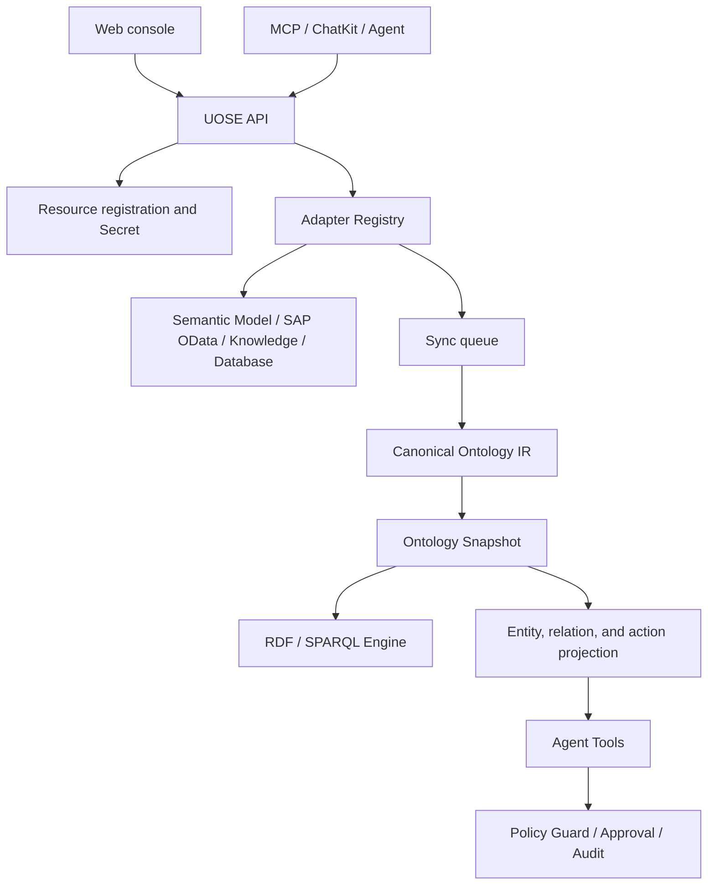

The UOSE system consists of a control plane, sync and semantic layer, execution plane, governance layer, and frontend workbench. Together they connect external resources as ontology objects and expose stable tool interfaces to Agents.

## UOSE System Architecture

The diagram below shows the layered structure of the UOSE system itself: users and Agents enter through the Web console, ChatKit, ontology assistant, business assistants, and MCP Client; the identity and context layer handles tenant, organization, user, and Assistant resource access boundaries; the data-xpert API provides resource registration, Secrets, sync, ontology publishing, Agent Tools, policy, approval, and audit services; the resource adapter layer connects semantic models, SAP OData, knowledge graphs, and databases; the ontology semantic layer publishes external resources as ontology snapshots, RDF graphs, and entity/relation/action projections; the governance and storage layer handles policies, approvals, audits, caches, queues, and secret protection.

## data-xpert and XpertPRO Integration Architecture

The diagram below shows how the UOSE system is deployed and collaborates within the XpertPRO ecosystem. The left side shows XpertPRO platform capabilities, including applications, Server Core, Server AI, BI semantic analysis, the plugin system, and ChatKit UI. The middle shows data-xpert hosting the UOSE control plane, resource adapter layer, semantic modeling and execution layer, governance and secure runtime layer, and underlying infrastructure. The right side shows external business systems such as SAP, enterprise databases, business APIs, and document systems. The bottom connects three main flows: resource sync and ontology generation, Agent query and analysis, and controlled action execution.

## Layered Architecture

## Control Plane

The control plane manages how resources enter UOSE:

- Secret Manager stores connection credentials and versions.
- External Resource Registry stores resource ID, type, connection reference, owner, version, tags, and capabilities.
- Resource Type Catalog displays supported resource types, default configuration, capability forms, and recommended secret templates.
- Resource Sync Queue supports asynchronous sync, deduplication, retry, cancellation, and historical cleanup.

The control plane emphasizes resource-level boundaries. Each resource has clear type, connection, capability, and sync status.

## Semantic Layer

The semantic layer converts external resource metadata into a unified ontology:

- Adapters pull external metadata and normalize it.
- Manifests define entity types, relation types, action types, metrics, rules, and policies.
- Canonical Ontology IR represents the intermediate ontology result that can be published.
- Ontology Snapshot stores versioned publish results.
- RDF sidecars or local query backends support schema, neighborhood, and raw graph queries.
- Projection writes the current snapshot into runtime tables such as `uose_entity`, `uose_relation`, and `uose_action`.

The semantic layer is the source of Agent context and the source of evidence for the governance layer.

## Execution Plane

The execution plane exposes fixed capabilities through Agent Tools:

- `queryEntities`: locate entities by intent, type, and keywords.
- `getEntityNeighborhood`: read the one-hop neighborhood and related entities for a target object.
- `queryOntologySchema`: inspect resource ontology schema.
- `discoverActions`: discover executable actions and rejection reasons for a target object.
- `simulateAction`: validate parameters, policy, and readiness before execution.
- `executeAction`: call the adapter to execute an action.
- `getAuditTrace`: view the audit trace for a task.

The execution plane does not require Agents to know backend system details. It lets Agents use a unified object and action protocol.

## Governance Layer

The governance layer is responsible for execution boundaries:

- Policy Binding configures `allow`, `deny`, and `require_approval` for resources, actions, and entity types.
- Policy Guard performs policy decisions in the action simulation and execution flow.
- Approval Request stores execution requests waiting for approval; high-risk actions can continue only after approval.
- Agent Execution Audit records tool calls, policy results, inputs and outputs, evidence references, and status.

The governance layer gives UOSE the explainability required for enterprise compliance.

## Frontend Workbench

The current product frontend includes:

- Resource access: register, edit, sync, and view resources.
- Resource details: view context, ontology graph, sync jobs, and abnormal events.
- Ontology workspace: view snapshot status across resources, search entities, and drill into graphs.
- Policy governance: configure policy bindings and run evaluations.
- Approval queue: process execution requests with `require_approval`.
- Execution audit: review Agent and system action flows.
- Resource chat and Agent Workbench: use the ontology assistant through ChatKit in resource context.

This architecture makes the UOSE system a stable hub between resources, semantics, Agents, and governance.
