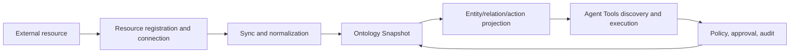

The UOSE system is an object-semantic execution platform for enterprise data, knowledge, and business systems. It converts models, tables, fields, metrics, entities, services, APIs, and operations from external resources into a unified ontology object space that can be queried, governed, and executed. Agents no longer need to deal directly with scattered APIs, databases, or documents; instead, they complete discovery, planning, simulation, execution, and auditing within one semantic contract.

**Use the system:** [Open UOSE](https://data.xpertai.cn/)

## Core Problem

Enterprise data and systems are often fragmented in four ways:

- Resource fragmentation: BI semantic models, SAP OData, knowledge bases, databases, and business APIs all use different protocols.
- Semantic fragmentation: the same business object may have different names, fields, granularity, and constraints in different systems.
- Execution fragmentation: querying, writing, approvals, replay, and auditing are distributed across different flows.
- Agent fragmentation: agents can easily start composing SQL, API parameters, or business meanings from natural language guesses.

The product goal of the UOSE system is to converge these fragments into a unified object space: objects have types, attributes, relationships, constraints, actions, and evidence; actions have input contracts, risk levels, policy decisions, and audit results.

## Unified Object-Semantic Execution

UOSE is the product implementation of Unified Object-Semantic Execution. It emphasizes three kinds of unification:

- Object: convert identifiable objects in external resources into entity instances, such as `semantic_cube`, `sap_odata_entity_set`, `knowledge_entity`, and `database_table`.
- Semantic: persist business relationships, field meanings, aliases, constraints, and context between objects as an ontology snapshot.
- Execution: convert executable capabilities of objects into actions, such as `semantic_model.query_cube_slice`, `sap_odata.read_collection`, and `database.query_select`.

Therefore, the UOSE system is not simply a data catalog or a tool invocation gateway. Its core value is that, after a resource is connected, it automatically gains semantic visibility, action discoverability, controllable execution, and traceable results.

## Product Loop

A typical loop includes:

1. An administrator registers a resource and configures connection secrets and capabilities.
2. The system syncs external resource metadata and generates canonical ontology IR.
3. The ontology layer publishes a snapshot and projects it into entity, relation, and action instances.
4. The Agent obtains the minimum necessary context through `queryEntities`, `getEntityNeighborhood`, and `discoverActions`.
5. Before execution, the Agent calls `simulateAction`; after policy and parameter checks pass, it calls `executeAction`.
6. The system records audit information; high-risk actions enter the approval queue according to policy.

## Product Boundaries

The UOSE system is responsible for giving external resources semantics, executable actions, and governance controls, but it does not replace the source systems themselves:

- It does not copy business ownership from source systems.
- It does not bypass source system permissions, authentication, or concurrency control.
- It does not require every resource to become a heavy ontology from the start.
- It does not allow Agents to freely call arbitrary backend APIs.

It provides a unified control plane and execution plane for enterprise agents to access resources.
