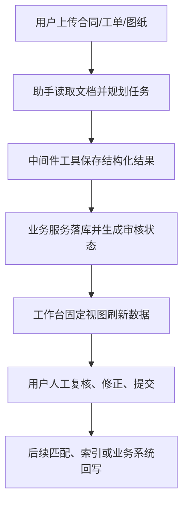

智能体应用不是一个更长的提示词，也不是把几个工具挂到智能体上就结束。一个可投入业务的智能体应用通常由五部分组成：

- **[业务插件](../plugin/plugin-development)**：声明应用元数据、配置、生命周期和目标产品面。
- **[智能体中间件工具](../middleware/custom)**：由智能体中间件暴露，把业务动作转换成模型可按结构定义调用的工具。
- **业务服务与数据模型**：保存结构化结果、审核状态、来源证据和执行记录。
- **[工作台视图](../../data/features/agent-execution/workbench-and-chatkit)**：给用户一个可核对、可修正、可提交的人工协同界面。
- **[助手模板](../agent/ai-assistant/configure-ai-assistant)**：让业务用户一键创建已经装配好工具、提示词和运行参数的智能体。

本文以一个 BOM 文档接入类业务插件为参考案例，说明如何在 Xpert 平台中开发一个自定义智能体应用。为了便于迁移到自己的业务场景，下面只保留关键设计和代码示例，不展开具体源码位置。

## 相关功能文档

阅读本文时，可以结合以下平台功能文档：

- [插件开发](../plugin/plugin-development)、[插件核心概念](../plugin/core-concepts) 与 [插件配置表单](../plugin/schema-ui-extension)
- [智能体中间件](../middleware)、[自定义中间件](../middleware/custom) 与其中暴露的中间件工具
- [工作台与资源对话](../../data/features/agent-execution/workbench-and-chatkit)、[ChatKit](../chatkit) 与 [远程组件](../plugin/remote-component)
- [助手配置](../agent/ai-assistant/configure-ai-assistant) 与 [插件发布和使用](../plugin/publish-and-use)

## 参考架构

BOM 文档接入类插件的目标是把合同包、技术协议、图纸、BOM 表格和工程变更文档转成可审核、可追溯、可匹配的结构化数据。它的关键设计是让智能体负责抽取、比较和批量调用工具，让工作台负责上传、查看、确认、驳回和人工复核。

典型链路如下：



对于一个新的智能体应用，你也可以先按这条链路拆分职责：哪些事情由智能体自动完成，哪些事情必须让人确认，哪些结果需要可追溯保存。

## 步骤 1：定义插件入口和目标应用能力

[插件入口](../plugin/plugin-development)负责声明插件的基础信息、配置结构、模板贡献和注册模块。

在 BOM 插件中，`XpertPlugin` 的核心信息包括：

- `meta.name`：插件包名，例如 `@acme/plugin-contract-review`。
- `meta.level`：系统级、全局级或组织级插件。
- `meta.targetApps`：插件要出现在哪些上层应用中，例如 `data-xpert`。
- `meta.targetAppMeta["data-xpert"].types`：上层应用使用的业务类型，例如 `workbench-view`、`assistant-tool`、`business-app`。
- `meta.targetAppMeta["data-xpert"].capabilities`：可被插件中心、模板和治理逻辑识别的业务能力。
- `config.schema` 与 `config.formSchema`：运行时配置结构和前端配置表单。
- `templates`：向平台贡献可创建的助手模板。

简化后的模式如下：

```ts
import { z } from 'zod'
import type { XpertPlugin } from '@xpert-ai/plugin-sdk'
import { MyAgenticAppPlugin } from './lib/my-agentic-app.plugin'

const ConfigSchema = z.object({
  defaultKnowledgebaseId: z.string().optional()
})

const plugin: XpertPlugin<z.infer<typeof ConfigSchema>> = {
  meta: {
    name: '@acme/plugin-contract-review',
    version: '0.1.0',
    level: 'system',
    category: 'middleware',
    targetApps: ['data-xpert'],
    targetAppMeta: {
      'data-xpert': {
        types: ['workbench-view', 'assistant-tool', 'business-app'],
        capabilities: ['contract-review', 'review-workbench']
      }
    },
    displayName: '合同审核',
    description: '解析合同并提供审核工作台。',
    author: 'Acme'
  },
  config: {
    schema: ConfigSchema
  },
  templates: [],
  register() {
    return { module: MyAgenticAppPlugin, global: true }
  }
}

export default plugin
```

设计建议：

- 把 `targetAppMeta` 当作上层应用的能力合同，不要把业务能力只写在描述文本里。
- 如果插件需要在 data-xpert 插件中心展示，必须声明 `targetApps: ['data-xpert']` 和非空的 `targetAppMeta["data-xpert"].types`。
- 配置项只放真正需要部署或管理员调整的内容，例如默认资源 ID、召回方式、外部服务地址。

## 步骤 2：注册服务端模块、实体和生命周期

插件的服务端模块通常使用 `@XpertServerPlugin` 注册，相关概念可参考[插件核心概念](../plugin/core-concepts)。BOM 类插件会在服务端模块中注册 TypeORM 实体、业务服务、[智能体中间件](../middleware)和工作台视图提供器。

一个智能体应用至少需要三类提供器：

- **业务服务**：实现保存、查询、审核、匹配、提交等业务逻辑。
- **智能体中间件**：把部分业务动作转换成中间件工具。
- **视图提供器**：把业务数据和操作暴露给工作台。

简化结构如下：

```ts
import { TypeOrmModule } from '@nestjs/typeorm'
import { XpertServerPlugin } from '@xpert-ai/plugin-sdk'
import { ContractReviewMiddleware } from './contract-review.middleware'
import { ContractReviewService } from './contract-review.service'
import { ContractReviewViewProvider } from './contract-review-view.provider'
import { ContractDocument, ContractLine } from './entities'

const ENTITIES = [ContractDocument, ContractLine]

@XpertServerPlugin({
  imports: [TypeOrmModule.forFeature(ENTITIES)],
  entities: ENTITIES,
  providers: [
    ContractReviewService,
    ContractReviewMiddleware,
    ContractReviewViewProvider
  ],
  exports: [ContractReviewService]
})
export class ContractReviewPlugin {}
```

数据模型不要只满足“工具能跑通”。面向业务审核的智能体应用通常还要保存：

- 原文证据、来源文件、页码、置信度。
- 智能体判断、人工审核状态、审核备注。
- 失败原因和重试任务。
- 与外部系统或知识库的匹配记录。

BOM 插件就是这样处理合同成品行、技术属性、技术差异、BOM 匹配结果和重新解析任务的。

## 步骤 3：把业务动作暴露成智能体中间件工具

[智能体中间件](../middleware/custom)是智能体应用的自动化入口。这里的“工具”指中间件返回给智能体运行时的可调用工具。BOM 插件没有把“解析合同”做成一个大而全的工具，而是拆成了顺序明确的中间件工具：

```text
bom_upsert_parsed_contract
  -> bom_upsert_contract_product_line
  -> bom_finalize_parsed_contract
```

这个拆法很重要：智能体先保存合同头，再逐行保存产品、技术属性和技术差异，最后完成解析。这样可以让长文档任务分批落库，也能在中途失败时保留可追踪状态。

设计自己的工具时，建议遵守下面的规则：

- 每个工具只做一个清晰业务动作。
- 使用 zod 结构定义输入，字段描述要告诉智能体何时调用、如何调用、哪些字段必填。
- 在工具描述中写清调用顺序和边界条件。
- 对长列表使用“逐条保存”而不是一次提交巨大数组。
- 提供失败上报工具，避免智能体无法完成时静默结束。

简化工具示例：

```ts
const saveContractHeaderTool = tool(
  async (input) => {
    const contract = await service.upsertContractHeader(input)
    return JSON.stringify({
      message: '合同头已保存。接下来请逐行保存合同明细。',
      contractId: contract.id,
      status: contract.status
    })
  },
  {
    name: 'contract_upsert_header',
    description:
      '创建或重置已解析的合同头。保存合同明细前必须先调用此工具。',
    schema: contractHeaderSchema
  }
)
```

对于文档解析类应用，还应把证据要求写进结构定义和工具描述。例如 BOM 插件要求每个重要技术属性包含 `sourceRole`、`sourceDocumentName`、`page`、`evidenceText` 和 `confidence`，让后续审核可以追溯到原文。

## 步骤 4：创建工作台审核界面

真正的业务应用不能只把结果丢回聊天窗口。用户需要在[工作台](../../data/features/agent-execution/workbench-and-chatkit)中查看列表、筛选结果、打开来源文件、修改字段、确认差异和提交审核。

BOM 类插件会通过视图提供器注册一个固定视图，例如 `BOM 审核台`。如果需要 iframe 形式的插件界面，可参考[远程组件](../plugin/remote-component)。它的清单声明了：

- 视图位置：智能体工作台主槽位或固定槽位。
- 渲染方式：`remote_component + react + iframe`。
- 数据查询能力：分页、搜索、排序、参数。
- 操作能力：普通 JSON 动作、文件动作、行级动作、工具栏动作。
- 宿主事件订阅：监听助手工具完成事件并转发给 iframe。

简化清单结构如下：

```ts
{
  key: 'contract_review',
  title: { en_US: 'Contract Review', zh_Hans: '合同审核' },
  hostType: 'agent',
  view: {
    type: 'remote_component',
    runtime: 'react',
    protocolVersion: 1,
    component: {
      isolation: 'iframe',
      entry: 'contract-review'
    },
    dataSource: {
      mode: 'platform'
    }
  },
  actions: [
    {
      key: 'approve_line',
      label: { en_US: 'Approve', zh_Hans: '确认' },
      actionType: 'invoke',
      placement: 'row'
    }
  ]
}
```

工作台视图的关键原则是：iframe 不直接拿令牌，也不直接访问宿主接口。它通过受控的 `postMessage` 桥接请求数据和执行动作，由平台接口重新解析助手、组织、租户和权限，再转发到视图宿主。

## 步骤 5：用工具完成事件刷新视图

智能体应用的体验应该是连续的：用户在聊天里让助手解析合同，工具调用完成后，审核台自动切到对应标签页并刷新数据。

BOM 插件通过清单中的 `hostEvents.subscriptions` 订阅工具完成事件。相关前端工作台与 ChatKit 事件链路可参考[工作台与资源对话](../../data/features/agent-execution/workbench-and-chatkit)：

```ts
hostEvents: {
  subscriptions: [
    {
      key: 'contract-review-tool-completed',
      event: 'assistant.tool.completed',
      filter: {
        sources: ['chatkit'],
        toolNames: ['contract_upsert_header', 'contract_save_line']
      },
      action: {
        type: 'forward',
        debounceMs: 1000
      }
    }
  ]
}
```

推荐做法：

- 普通声明式视图可以使用 `refresh`。
- iframe 远程组件推荐使用 `forward`，由前端根据 `toolName` 和工具输出自己决定切换标签页、刷新局部数据或更新查询参数。
- 不要在 data-xpert 工作台宿主代码里硬编码某个插件的工具名或视图键；这些应该由插件清单声明。
- 转发给 iframe 的事件不能包含令牌、接口地址、`assistantId`、`tenantId`、`organizationId` 等敏感上下文。

## 步骤 6：提供助手模板

业务用户不应该手动装配每个中间件、模型参数和提示词。智能体应用应该通过模板贡献一个可创建的助手；助手的常规配置方式可参考[配置 AI 助手](../agent/ai-assistant/configure-ai-assistant)。

BOM 类插件会通过模板贡献代码暴露助手模板，并加载一份 DSL（领域专用语言）内容。模板里声明了：

- `type: Agent`
- `targetApps: ['data-xpert']`
- `requiredPlugins`
- `capabilities`
- 默认业务域和管理方
- 初始提示词
- DSL 中的智能体、中间件、工具集、状态变量和模型参数

简化示例：

```ts
export const templates = [
  {
    key: 'contract-review-assistant',
    title: '合同审核助手',
    type: XpertTypeEnum.Agent,
    targetApps: ['data-xpert'],
    targetAppMeta: {
      'data-xpert': {
        types: ['business-assistant'],
        capabilities: ['contract-review', 'review-workbench'],
        requiredPlugins: ['@acme/plugin-contract-review']
      }
    },
    dslContent,
    startPrompts: [
      '请解析这个合同包，并保存合同头、产品行和差异。',
      '请重新分析这个合同，并保留来源证据。'
    ]
  }
]
```

模板的提示词要告诉助手：

- 当前业务身份是什么。
- 可以调用哪些工具完成哪些任务。
- 什么情况下必须先读取文件或查看图片。
- 什么字段必须保留证据和置信度。
- 失败时应调用哪个失败工具或输出什么待处理结果。

## 步骤 7：独立插件仓库开发、构建和接入

正式的业务插件建议在独立插件仓库中开发，例如采用类似 `xpert-plugins` 的工作区结构。宿主 Xpert 应只负责加载、校验和运行插件，不建议把正式插件代码直接写进宿主应用仓库。插件接入和发布流程可参考[插件发布和使用](../plugin/publish-and-use)。

一个插件包至少需要声明自己的包名、构建入口和 SDK 对等依赖：

```json
{
  "name": "@acme/plugin-contract-review",
  "version": "0.1.0",
  "main": "dist/index.cjs.js",
  "types": "dist/index.d.ts",
  "peerDependencies": {
    "@xpert-ai/plugin-sdk": "^3.8.0"
  }
}
```

推荐开发流程：

```bash
pnpm install
pnpm nx build plugin-contract-review
```

构建产物应包含插件入口、类型声明、运行时代码和远程组件静态资源。开发期可以把独立插件仓库接入 Xpert 实例联调；启动宿主接口前，先显式允许插件仓库所在的工作区根目录：

```bash
export PLUGIN_WORKSPACE_ROOTS="/abs/path/to/xpert-plugins"
```

然后通过插件安装接口或项目提供的安装脚本，把独立插件包注册到当前组织：

```bash
pnpm plugin:install:local \
  --workspace-path /abs/path/to/xpert-plugins/acme/contract-review \
  --org-id <your-org-id> \
  --token <your-token>
```

代码变更后，重新构建插件包，再重新安装或重新加载插件。这样可以避免宿主应用和插件仓库之间出现重复的运行时依赖。

发布到生产环境时，通常有两种方式：

- **独立发布**：把插件作为 npm 包或企业内部制品发布，由平台按插件安装流程加载。
- **随产品内置**：只有平台自带的系统插件才进入宿主默认插件清单和部署包清单。

无论哪种方式，都要保持 `@xpert-ai/plugin-sdk` 为对等依赖，避免插件打包自己的 SDK 副本。

## 步骤 8：测试与验收

建议至少覆盖这些场景：

- 插件生命周期：能被加载、启动、停止，SDK 对等依赖没有重复打包。
- 配置结构：默认值、表单字段、非法配置校验。
- 工具结构定义：必填字段、错误输入、调用顺序和失败工具。
- 业务服务：保存、覆盖、分页查询、状态流转、来源证据保留。
- 工作台清单：固定入口、动作、文件动作、宿主事件。
- 远程组件：iframe 初始化、数据加载、动作调用、工具完成事件刷新。
- 助手模板：创建后能看到正确中间件、提示词、模型参数和初始提示词。
- 端到端流程：用户上传文档，助手调用工具保存结果，工作台自动刷新，人工审核后提交。

对于 BOM 这类文档解析应用，额外要检查：

- 每个业务行都有稳定行号。
- 每个关键字段都有来源证据。
- 智能体无法判断时不会强行填充，而是生成待确认差异或审核建议。
- 长文档分批保存后，最终状态可以正确完成或失败。

## 可迁移的设计清单

开发新的智能体应用时，可以用下面的清单快速自检：

| 设计项 | 问题 |
| --- | --- |
| 业务闭环 | 智能体完成什么，人审核什么，系统最终沉淀什么？ |
| 插件清单 | 是否声明了 `targetApps`、`targetAppMeta`、类型和能力字段？ |
| 数据模型 | 是否保存来源证据、置信度、审核状态和失败原因？ |
| 智能体中间件工具 | 是否有结构定义、调用顺序、逐条保存和失败上报？ |
| 工作台视图 | 是否提供列表、详情、修改、确认、提交和文件预览？ |
| 事件刷新 | 工具完成后视图是否能自动刷新到正确上下文？ |
| 助手模板 | 用户是否能一键创建已经装配好的业务智能体？ |
| 测试 | 是否覆盖工具、服务、视图、模板和端到端流程？ |

当这些问题都有明确答案时，你的自定义智能体应用就不再只是一个智能体配置，而是一个可以被安装、治理、复用和持续迭代的 Xpert 平台业务应用。
