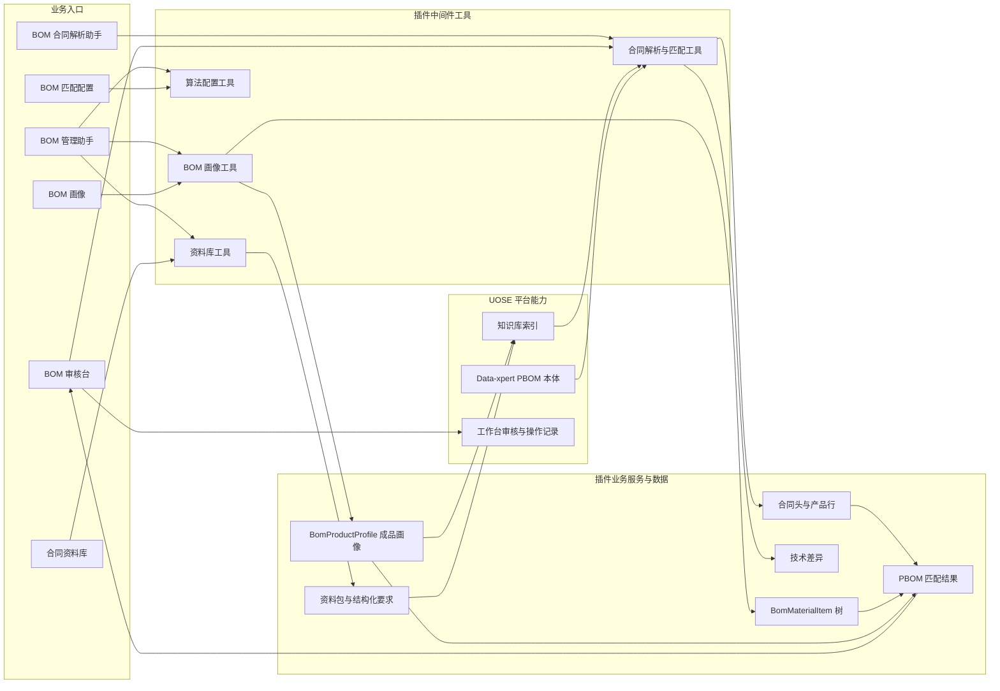
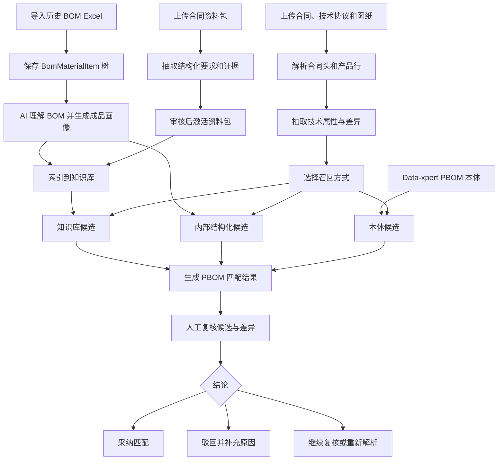

合同 BOM 智能助理是 UOSE 系统中的官方业务应用，面向电动机等制造场景的合同包解析、BOM 画像维护、合同资料库复用和 PBOM 匹配审核。它把助手自动抽取能力、UOSE 知识库、本体资源和 Agent 工作台审核台连接成一个可追溯的业务闭环。

## 适用场景

- 销售合同、技术协议、图纸和资料包需要被解析为结构化合同数据。
- 合同产品行需要匹配到历史导入的 PBOM 根节点，并输出相似度、置信度和差异说明。
- 技术协议、项目规范、图纸、数据表等资料需要长期入库复用。
- BOM Excel 需要导入为树形 PBOM，并沉淀为可检索、可复核的成品画像。
- 业务人员需要在工作台中确认技术差异、采纳或驳回匹配结论。

## 插件地址

应用市场：[合同 BOM 智能助理](https://data.xpertai.cn/plugins/%40xpert-ai%2Fplugin-bom-document-intake)

## 安装后获得

管理员从应用市场启用应用后，会在 UOSE / Data-xpert 中获得以下能力：

| 类型 | 名称 | 用途 |
| --- | --- | --- |
| 工作台视图 | BOM 审核台 | 查看合同数据、执行 BOM 匹配、复核候选和差异。 |
| 工作台视图 | BOM 画像 | 上传 BOM Excel、预览并导入 BOM 树、维护成品画像。 |
| 工作台视图 | 合同资料库 | 管理可复用合同资料包、结构化要求、证据和知识库索引。 |
| 工作台视图 | BOM 匹配配置 | 管理匹配算法、召回源和评分权重。 |
| 助手模板 | BOM 合同解析助手 | 解析合同包、保存合同头和产品行、分析技术差异、执行 PBOM 匹配。 |
| 助手模板 | BOM 管理助手 | 维护合同资料库、产品画像、知识库索引和算法配置。 |

## 角色建议

| 角色 | 推荐入口 | 主要职责 |
| --- | --- | --- |
| 合同处理人员 | BOM 审核台、BOM 合同解析助手 | 上传合同包，核对合同数据和技术差异，执行 PBOM 匹配。 |
| BOM/画像管理员 | BOM 画像、BOM 管理助手 | 导入 BOM Excel，维护人工画像或 AI 理解画像，重建 BOM 知识库索引。 |
| 资料库管理员 | 合同资料库、BOM 管理助手 | 入库资料包，审核结构化要求，激活并索引可复用资料。 |
| 算法管理员 | BOM 匹配配置 | 调整召回、评分和置信度相关配置。 |

## 系统架构图

合同 BOM 智能助理把工作台视图、助手模板、插件中间件、业务数据和 UOSE 平台能力串联起来。工作台负责上传、查看、确认和配置；助手负责读取文件、抽取事实、比较差异并调用工具；插件服务负责落库、索引和匹配。



## 端到端流程图

从代码实现看，应用不是单纯的文件解析器，而是先把历史 PBOM、合同资料和新合同包都沉淀为可复核数据，再执行候选召回、差异解释和人工确认。



## 使用前准备

使用前建议准备：

- 一个已启用合同 BOM 智能助理的 UOSE 工作区。
- 至少一个可用于 BOM 或合同资料库索引的知识库。
- 需要复用的历史 BOM Excel，格式为 `.xlsx` 或 `.xls`。
- 待处理合同包，例如销售合同、技术协议、图纸、数据表、检查表或压缩包。
- 如需要本体召回，准备可访问的 Data-xpert PBOM 资源 ID，或确保系统可以在当前 PBOM 快照中搜索。

## 推荐流程

### 1. 导入 BOM 并维护成品画像

进入 **BOM 画像** 视图的 **BOM 维护**标签页，上传 BOM Excel 后先预览导入结果。确认根物料、层级结构、错误提示和替换范围无误后，再提交导入。

导入成功后，系统会保存树形 `BomMaterialItem`。对于后续需要长期匹配复用的 PBOM 根节点，点击 **AI 理解 BOM**，让助手写入统一 `BomProductProfile`。成品画像会沉淀型号、机座号、功率、极数、电压、防护等级、接线盒方向、协议特征和关键组件事实。

需要知识库召回时，在视图中选择目标知识库并执行 **索引 BOM 知识库**。应用会按稳定 `writeKey` 清理旧分块后重新写入，不会重复累积同一 BOM 根节点的历史索引。

### 2. 建设合同资料库

进入 **合同资料库** 视图，创建资料包并上传 zip、PDF、Word、Excel、图片或图纸文件。zip 文件会按包内目录展开并进入知识库解析流程。

随后让 **BOM 管理助手** 从知识库原文 chunk 中抽取结构化要求。每条要求都应保留来源文件、页码或位置、原文证据、适用范围和置信度。管理员审核后，将资料包设为 `active`，并重建资料库知识库索引。

合同资料库适合保存长期稳定要求，例如技术协议条款、项目规范、图纸约束、证书和检验交付要求。临时会话内的文件理解可以辅助补证据，但不替代资料库的长期主存储。

### 3. 解析合同包

创建或打开 **BOM 合同解析助手**，上传合同、技术协议、图纸和相关资料。可以直接对助手说：

```text
请解析这个合同包，并保存合同头、产品行和技术差异。
```

助手会先保存合同头，再逐行保存成品产品。每个产品行都应包含 `technicalAttributes` 和 `technicalDifferences`；确实没有属性或差异时，也需要显式保存为空数组。全部行保存完成后，助手会完成合同解析，合同即可出现在 **合同数据** 和 **BOM 匹配** 标签页中。

### 4. 核对合同数据和技术差异

进入 **BOM 审核台** 的 **合同数据**标签页，检查合同头、来源文档、产品行、结构化技术属性和差异判断。

技术差异常见类型包括：

| 类型 | 含义 |
| --- | --- |
| `value_conflict` | 合同备注与技术协议或图纸对同一属性给出了冲突取值。 |
| `missing_in_remark` | 技术协议或图纸有要求，但合同备注未体现。 |
| `missing_in_agreement` | 合同备注有要求，但技术协议或图纸未找到对应条款。 |
| `scope_ambiguous` | 条款适用的合同行范围不清。 |
| `source_uncertain` | 来源或置信度不足，需要人工核查。 |

业务人员可以将差异标记为确认、忽略、需修正或保持待处理。重新解析合同时，建议保留同一合同编号或合同 ID，便于覆盖旧结果并保留复核闭环。

### 5. 执行 PBOM 匹配

进入 **BOM 审核台** 的 **BOM 匹配**标签页，选择已完成解析的合同、召回方式、知识库和候选数量，然后执行匹配。

可用召回方式包括：

| 方式 | 适用情况 |
| --- | --- |
| `internal` | 只使用已导入 BOM 的结构化字段和组件事实。 |
| `knowledgebase` | 使用知识库中的 BOM 根节点分块进行召回。 |
| `ontology` | 使用 Data-xpert PBOM 本体候选。 |
| `dual` | 合并内部召回和知识库召回。 |
| `multi` | 合并内部召回、知识库召回和本体召回。 |

匹配结果会展示推荐 BOM、Top 候选、相似度、置信度、规格差异、协议特征缺失、组件缺失或冲突，以及召回过程 trace。置信度高于 `0.85` 通常可以作为自动推荐；`0.70 - 0.85` 建议人工复核；低于 `0.70` 不建议直接指定参考 BOM。

### 6. 复核和回写结论

在候选详情中查看 **召回过程**、命中文档、映射方式和差异解释。确认无误后可以采纳匹配；若候选不适用，可以驳回并补充原因；若证据不足，可以让助手继续复核并保存 AI 复核结果。

## 证据和数据质量要求

- 重要字段必须尽量带来源证据，例如文件名、页码、条款、表格位置或图纸区域。
- 合同解析保存的是合同事实和 Agent 判断，不应把无证据的推测写成确定结论。
- `BomProductProfile` 是长期可复用的成品画像层，不替代原始 BOM Excel。
- 合同资料库中的结构化要求需要经过管理员审核后，才应作为默认比对依据。
- 知识库索引是可重建检索层，不是权威业务表；删除 BOM 根节点或资料包时，应用会清理自身写入的稳定索引分块。

## 常见问题

### BOM 匹配标签页里看不到合同

确认助手已经调用完成合同解析，并且合同处于完成状态。只保存合同头或只保存部分产品行时，合同不会作为可匹配对象出现。

### 匹配结果置信度很低

通常是合同产品规格缺字段、BOM 成品画像不足、知识库未索引，或召回方式选择过窄。先补齐合同技术属性和 BOM 产品画像，再使用 `dual` 或 `multi` 召回复核。

### 合同资料库要求没有参与比对

检查资料包是否已审核为 `active`，结构化要求是否为 `confirmed` 或 `active`，并确认资料库索引已重建。

### 删除 BOM 后知识库仍有旧结果

应用会清理自己按 `bom-product-profile:v2:{rootId}:` 前缀写入的分块。若旧结果来自用户手工上传文档或其他应用写入，需要在对应知识库中单独维护。

## 最佳实践

- 先导入并画像高频历史 BOM，再处理新合同包。
- 对长期复用资料先入库审核，不要每次只依赖临时上传文件。
- 让助手每次只保存一个合同行，保证技术属性、差异和证据可以逐条复核。
- 对低置信度匹配保留人工结论和原因，后续可以用于优化画像和匹配配置。
- 定期重建 BOM 和资料库索引，尤其是在更新 BOM Excel、成品画像或资料包要求之后。
