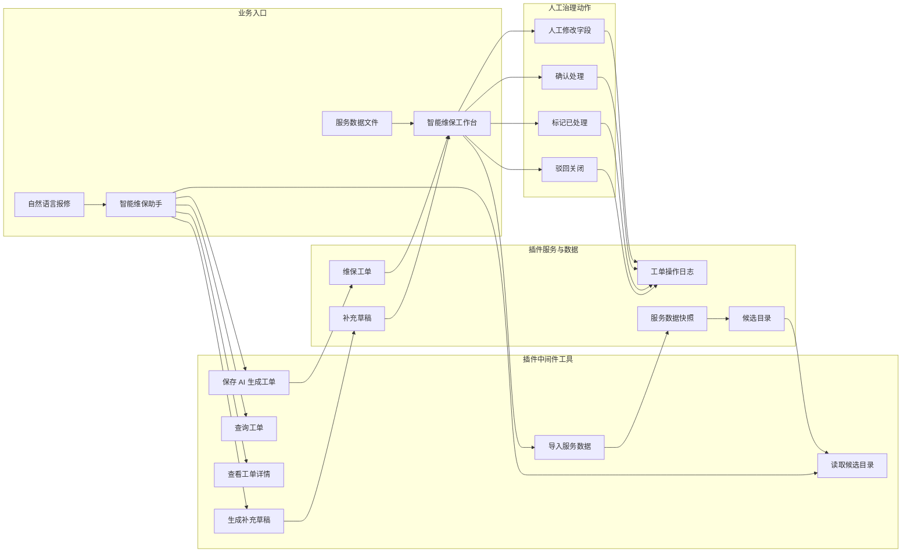
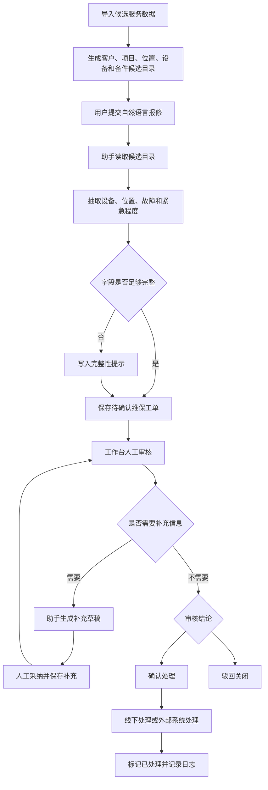

智能维保是社区插件应用中的维保工作台，面向设备报修受理、维保工单生成、候选主数据导入和人工审核补充。它把用户的自然语言报修转成待确认工单，并把关键处理动作留在工作台中由人工完成。

## 适用场景

- 生产设备、园区设施、售后设备或现场服务问题需要快速登记为维保工单。
- 用户以自然语言描述故障，需要助手抽取设备、位置、故障、紧急程度和初步诊断。
- 设备类型、故障类别、部门、岗位、备件等候选数据需要导入后供助手规范引用。
- 维保主管需要在工作台中补充、确认、驳回或标记工单处理结果。

第一版聚焦 Xpert 侧演示闭环，不直接集成真实 CMMS、FSM、ERP、派工、库存、通知、附件或 SLA 系统。

## 插件地址

应用市场：[智能维保](https://data.xpertai.cn/plugins/%40xpert-ai%2Fplugin-smart-maintenance)

## 安装后获得

| 类型 | 名称 | 用途 |
| --- | --- | --- |
| 工作台视图 | 智能维保工作台 | 导入服务数据、提交报修、查看和审核维保工单。 |
| 助手模板 | 智能维保助手 | 根据自然语言报修生成待确认工单，查询工单并生成补充草稿。 |
| 助手工具 | 智能维保工具 | 保存 AI 生成工单、导入服务数据、读取候选项、查询工单和准备补充草稿。 |

## 推荐角色

| 角色 | 主要职责 |
| --- | --- |
| 报修受理人员 | 提交报修描述，让助手生成待确认工单。 |
| 维保主管 | 在工作台中核对字段、补充信息、确认处理或驳回关闭。 |
| 服务数据管理员 | 导入客户、项目、位置、设备、部门、岗位和备件候选数据。 |

## 系统架构图

智能维保把自然语言报修、候选服务数据、AI 工单生成和人工审核工作台拆成清晰边界。助手工具负责保存待确认数据和查询信息，工作台视图负责所有人工治理动作。



## 处理流程图

第一版的核心流程是“AI 生成待确认工单 + 人工治理闭环”。服务数据导入后可以提升字段规范性；如果字段不完整，助手会留下完整性提示或补充草稿，而不是直接编造。



## 推荐流程

### 1. 导入候选服务数据

在工作台中上传服务数据文件，先生成候选数据草稿，再让助手调用 `smart_maintenance_import_service_data` 保存。候选数据用于规范设备类型、位置、部门、岗位、备件和故障类别。

如果尚未导入服务数据，应用会回退到内置模拟候选目录，适合演示和早期验证。

### 2. 生成待确认维保工单

打开 **智能维保助手**，输入报修描述，例如：

```text
三号车间空压机今天上午异响明显，温度升高，现场担心继续运行会停机，请生成一张维保工单。
```

助手会抽取结构化字段，并调用 `smart_maintenance_save_generated_work_order` 保存待确认工单。字段不完整时，助手应把缺失项写入完整性提示，不能编造设备编号、联系人、发生时间或位置。

### 3. 工作台人工审核

进入 **智能维保工作台** 查看工单详情。人工可以修改标题、设备、位置、故障类别、紧急程度、描述、AI 初步诊断和建议动作。

确认处理、标记已处理、驳回关闭等动作只在工作台中执行，不暴露为 Agent 工具。这样可以避免助手直接承诺“已派工”“已修复”或“已关闭”。

### 4. 补充和查询工单

用户补充信息时，助手可以调用 `smart_maintenance_prepare_supplement_draft` 保存补充草稿，审核人员再在工作台一键填入并人工保存。查询列表和详情时，助手可使用 `smart_maintenance_search_work_orders` 和 `smart_maintenance_get_work_order_detail`。

## 工具边界

| 工具 | 用途 |
| --- | --- |
| `smart_maintenance_save_generated_work_order` | 从自然语言报修保存待确认维保工单。 |
| `smart_maintenance_import_service_data` | 保存候选服务主数据快照。 |
| `smart_maintenance_get_catalog` | 返回设备、故障、位置、部门、岗位和备件候选项。 |
| `smart_maintenance_search_work_orders` | 按状态、关键词、设备类型和紧急程度查询工单。 |
| `smart_maintenance_get_work_order_detail` | 查看单张工单详情和操作日志。 |
| `smart_maintenance_prepare_supplement_draft` | 根据用户补充内容生成 AI 补充草稿。 |

## 数据质量要求

- AI 诊断只能作为初步判断，必须保留“需现场复核”的语气。
- 不完整字段要写入 `completenessTips`，不要用猜测补齐。
- 一次报修通常只保存一张工单；多设备或多故障时标记多问题提示。
- 工单确认、关闭和处理结果需要人工在工作台中完成。
- 操作日志应保留 AI 生成、人工修改、补充、确认处理、处理完成和驳回关闭记录。

## 常见问题

### 为什么助手不能直接关闭工单？

关闭工单属于人工治理动作。应用将确认处理、标记已处理和驳回关闭限制在工作台视图动作中，避免 Agent 越权完成业务状态流转。

### 候选设备或部门不准确怎么办？

先更新服务数据文件并重新导入候选主数据。助手读取的是当前候选数据；未导入时只会使用演示用模拟候选目录。

### 可以对接真实维保系统吗？

当前社区应用是可演示闭环。正式对接 CMMS、FSM、ERP、库存、通知或 SLA 时，需要扩展配置、权限、外部 API、状态映射和审计策略。
