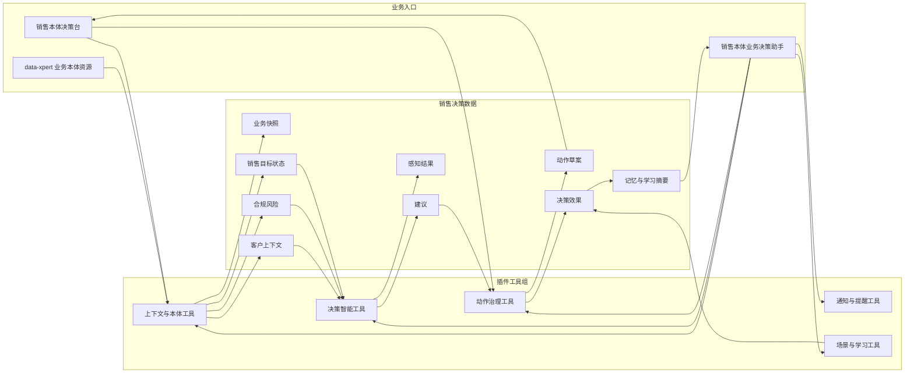
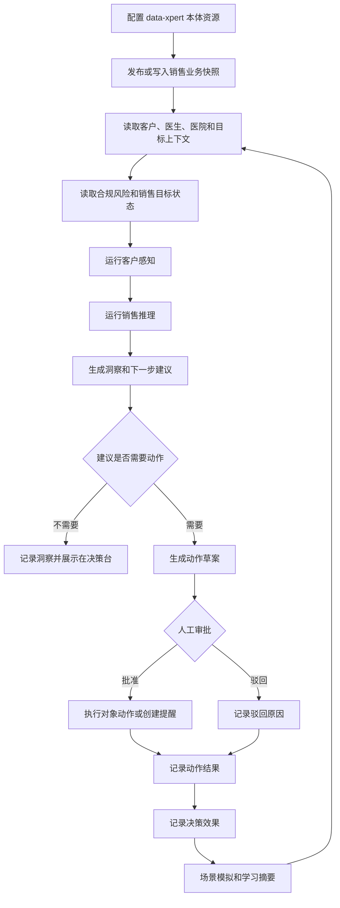

销售本体是社区插件应用中的销售业务决策应用。它围绕 data-xpert 业务本体，把客户、医生、医院、目标、合规预警、建议和动作草案组织成可感知、可推理、可治理的销售决策闭环。

## 适用场景

- 销售团队需要把客户、医院、医生、产品、目标和合规信号放入统一业务本体。
- 管理者希望基于销售对象运行感知，发现处方量下降、目标达成风险或合规异常。
- 助手需要生成下一步建议，并将高风险动作提交人工审批。
- 团队需要记录动作结果、决策效果、场景模拟和学习摘要。

## 插件地址

应用市场：[销售本体](https://data.xpertai.cn/plugins/%40xpert-ai%2Fplugin-sales-ontology)

## 安装后获得

| 类型 | 名称 | 用途 |
| --- | --- | --- |
| 工作台视图 | 销售本体决策台 | 查看感知结果、建议、动作草案、通知、提醒、场景模拟和决策效果。 |
| 助手模板 | 销售本体业务决策助手 | 读取销售本体上下文，运行感知、推理、建议生成和动作治理。 |
| 业务本体能力 | 销售本体业务本体 | 发布和查询销售业务对象、关系、洞察、建议和动作事实。 |
| 助手工具 | 销售本体工具 | 覆盖上下文读取、决策智能、动作治理、场景模拟和学习总结。 |

## 系统架构图

销售本体应用把 data-xpert 业务本体作为销售对象和关系的语义底座，再通过插件工具提供感知、推理、建议、动作治理和学习闭环。高风险动作先进入动作草案，由工作台进行人工审批和执行确认。



## 决策闭环图

应用的主链路是“本体上下文 -> 感知推理 -> 建议生成 -> 动作草案 -> 人工治理 -> 效果学习”。它适合把销售团队的判断过程显式化，而不是让助手直接跳过审批执行高风险动作。



## 推荐流程

### 1. 配置本体资源

管理员配置 data-xpert API 地址和默认本体资源 ID。应用可使用默认 `sales-ontology` 资源，也可以指向组织自己的业务本体资源。

### 2. 发布或写入业务快照

通过工作台或助手发布销售业务快照，包含客户、医生、医院、销售目标、合规预警、动作定义、建议和执行结果等对象。演示环境可以使用内置演示数据快速生成决策台记录。

### 3. 运行感知、推理和建议

助手可以读取客户上下文、合规风险和目标状态，运行感知与推理，再生成洞察和建议。例如：

```text
请读取销售本体中的客户和销售目标，运行感知并生成风险摘要。
```

常见输出包括高影响力客户低转化、销售目标低于计划、合规费用接近阈值、客户流失风险和下一步拜访建议。

### 4. 治理动作草案

对于需要执行或写回的业务动作，助手先生成动作草案。管理者可以在工作台中批准、驳回或执行动作，并记录执行结果。需要人工审批的动作不能绕过治理流程。

### 5. 场景模拟和学习

应用支持场景模拟、决策效果记录、记忆沉淀和学习摘要。管理者可以比较资源重新分配、产品组合优化、客户流失干预或合规风险应对等方案的预测影响。

## 工具范围

| 工具组 | 代表能力 |
| --- | --- |
| 上下文与本体 | 发布业务快照、读取领域本体、获取客户上下文、合规风险和销售目标状态。 |
| 决策智能 | 运行感知、推理、洞察生成和下一步建议。 |
| 动作治理 | 创建动作草案、执行对象动作、创建拜访记录、更新客户态度、标记合规风险。 |
| 通知与提醒 | 发送通知、创建跟进提醒。 |
| 场景与学习 | 模拟场景、记录决策效果、读取效果汇总、记录记忆和生成学习摘要。 |

## 典型问题

- 哪些高价值客户近期转化下降，需要优先拜访？
- 当前销售目标达成率是否低于计划，风险来自哪里？
- 哪些合规预警需要升级或人工复核？
- 如果调整预算、渠道或 KOL 投入，预测效果会如何变化？
- 某个建议是否需要审批，执行后如何记录结果？

## 治理边界

- 本体快照和动作事实应带来源和业务上下文，避免把临时推断写成长期事实。
- 涉及合规风险、费用、准入、客户状态变更的动作应走动作草案和审批。
- 工作台是人工治理入口，助手负责生成建议和草案，不应绕过人工审批。
- 决策效果和学习摘要用于改进后续建议，不替代业务负责人判断。
