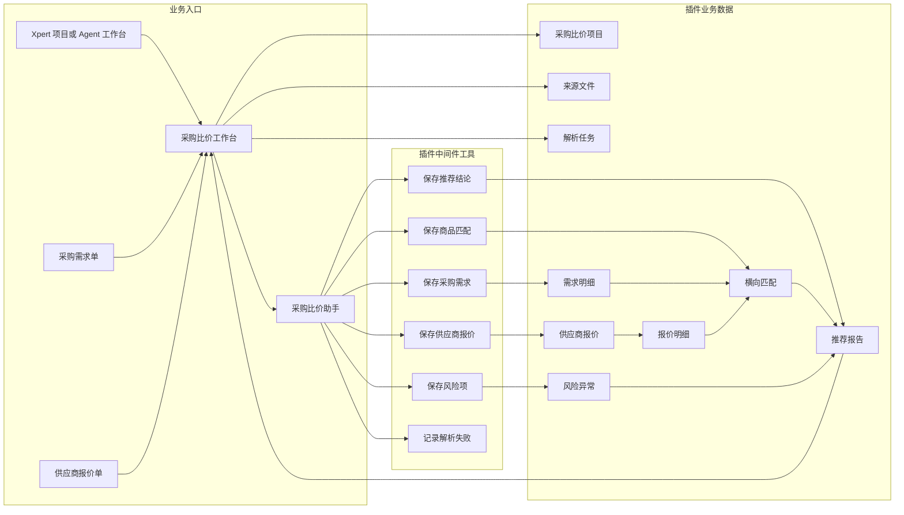
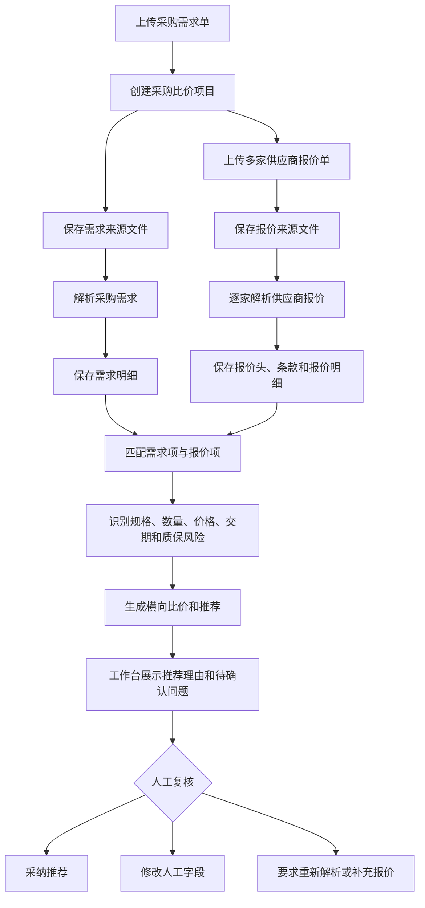

采购比价是社区插件应用中的 AI 采购比价助手，面向企业采购、行政采购、IT 设备采购和财务共享等场景。它在 Xpert 项目或 Agent 工作台中建立采购比价项目，由助手解析采购需求单和多家供应商报价单，再把结构化结果、风险和推荐写回工作台。

## 适用场景

- 采购人员需要比较多家供应商报价，而报价文件格式不统一。
- 需求单中包含物料、规格、数量、预算和期望交期，需要先结构化。
- 报价单需要抽取供应商、联系人、税率、交期、付款条款、质保和明细行。
- 需要判断规格不一致、数量不一致、报价缺失、交期风险、质保风险或价格异常。
- 用户需要追问“为什么不选最低价”并查看可解释推荐理由。

## 插件地址

应用市场：[采购比价](https://data.xpertai.cn/plugins/%40xpert-ai%2Fplugin-procurement-quote-comparison)

## 安装后获得

| 类型 | 名称 | 用途 |
| --- | --- | --- |
| 项目 / Agent 工作台视图 | 采购比价工作台 | 管理采购比价项目、上传文件、触发解析、查看比价结果和 AI 建议。 |
| 助手模板 | 采购比价助手 | 解析采购需求、供应商报价，生成横向比价、风险项和推荐报告。 |
| 助手工具 | 采购比价工具 | 保存需求解析、报价解析、商品匹配、风险项、推荐结论和解析失败状态。 |

## 系统架构图

采购比价应用以采购比价项目作为业务边界。工作台保存需求单和供应商报价单文件句柄，助手读取单份文件后调用中间件工具，插件服务再把需求、报价、匹配、风险和推荐写回同一个项目。

## 比价流程图

应用会把每家供应商报价作为独立来源文件解析，避免多份报价在同一轮消息中相互污染。最终推荐不是简单选择最低价，而是同时综合规格匹配、数量、税率、交期、质保、付款条款和风险异常。

## 推荐流程

### 1. 创建采购比价项目

进入 Xpert 项目详情页或 Agent 工作台的采购比价入口，上传采购需求单。应用会根据文件创建采购比价项目，并保存来源文件句柄，方便后续把原文件附给助手解析。

也可以手动创建比价项目，但推荐以需求单作为项目起点。

### 2. 上传供应商报价单

进入比价项目详情后，上传至少两家供应商报价单。每份报价单会作为独立来源文件保存，批量解析时每条消息只附带一家供应商文件，避免不同供应商报价内容互相污染。

### 3. 解析需求和报价

选择已挂载采购比价中间件的 Xpert，依次触发：

1. 解析采购需求。
2. 批量解析供应商报价。
3. 生成比价结果。

助手会调用 `procurement_save_requirement` 保存需求字段和采购项，调用 `procurement_save_supplier_quote` 保存供应商报价头、条款和明细。

### 4. 生成横向比价和推荐

完成解析后，助手会匹配报价明细与需求项，保存商品匹配、风险异常和最终推荐。工作台展示采购需求、供应商报价、横向比价、风险列表、推荐供应商、推荐理由、比价说明和待确认问题。

人工字段与 AI 字段发生冲突时，应用保留人工字段，并把冲突记录为待确认差异。

## 工具边界

| 工具 | 用途 |
| --- | --- |
| `procurement_save_requirement` | 保存采购项目字段和需求明细行。 |
| `procurement_save_supplier_quote` | 保存供应商报价头、条款和报价明细。 |
| `procurement_save_item_matches` | 保存报价明细到需求项的匹配结果。 |
| `procurement_save_risk_items` | 保存规格、数量、价格、交期、质保等风险发现。 |
| `procurement_finalize_recommendation` | 保存最终 AI 推荐、解释、报告草稿和待确认问题。 |
| `procurement_report_parse_failure` | 记录需求或报价解析失败，支持后续重新解析。 |

## 数据对象

| 对象 | 含义 |
| --- | --- |
| `ProcurementComparisonCase` | 采购比价项目，作为业务隔离边界。 |
| `ProcurementSourceDocument` | 采购需求单和供应商报价单来源文件。 |
| `ProcurementParseJob` | 解析任务和状态。 |
| `ProcurementRequirementItem` | 采购需求明细。 |
| `ProcurementSupplierQuote` | 供应商报价单头和商务条款。 |
| `ProcurementQuoteItem` | 报价明细行。 |
| `ProcurementItemMatch` | 需求项与报价项匹配关系。 |
| `ProcurementRiskItem` | 风险异常。 |
| `ProcurementRecommendation` | 推荐结论和说明。 |

## 最佳实践

- 至少上传两家供应商报价，才能形成有意义的横向比较。
- 对每家供应商报价单独解析，避免报价内容交叉引用。
- 对规格、型号、数量、交期和质保不一致的行保留证据。
- 最低价不应自动等于推荐供应商；应同时考虑交付、质保、规格匹配、付款条款和风险。
- 没有配置采购比价 Xpert 时，先完成助手模板创建和中间件授权。

## 当前边界

第一版不包含 ERP、SRM、OA、审批流、真实下单、供应商主数据、历史价格分析、预算占用、发票校验、合同法务审查或付款流程。它适合先验证采购文件理解、横向比价、风险识别和推荐解释闭环。
