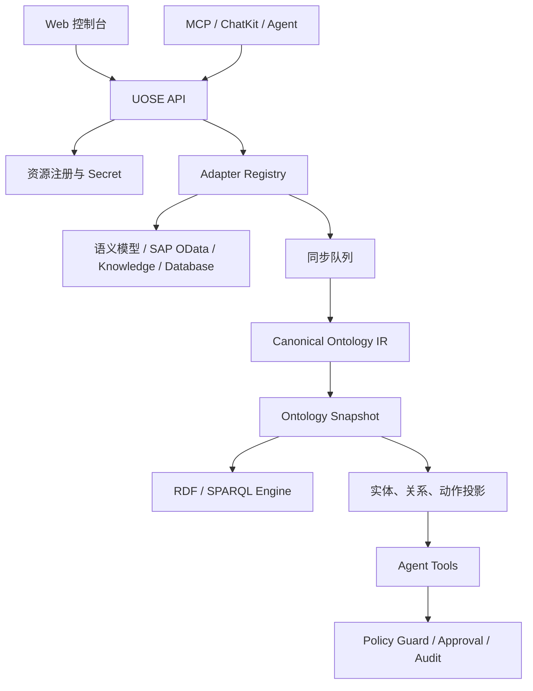

UOSE系统由控制面、同步与语义层、执行面、治理层和前端工作台组成。它们共同把外部资源接入为本体对象，并向 Agent 暴露稳定工具接口。

## UOSE 系统总体架构图

下图展示 UOSE系统自身的分层结构：用户与 Agent 通过 Web 控制台、ChatKit、本体助手、业务助理和 MCP Client 进入系统；身份与上下文层负责租户、组织、用户和 Assistant 资源访问边界；data-xpert API 提供资源注册、Secret、同步、本体发布、Agent Tools、策略、审批和审计服务；资源适配层连接 语义模型、SAP OData、知识图谱和数据库；本体语义层把外部资源统一发布为 ontology snapshot、RDF 图和实体/关系/动作投影；治理与存储层负责策略、审批、审计、缓存、队列和密钥保护。

## data-xpert 与 XpertPRO 集成架构图

下图展示 UOSE系统在 XpertPRO 生态中的部署和协作关系。左侧是 XpertPRO 平台能力，包括应用、Server Core、Server AI、BI 语义分析、插件系统和 ChatKit UI；中间是 data-xpert 承载的 UOSE 控制面、资源适配层、语义建模与执行层、治理安全运行层，以及底层基础设施；右侧是 SAP、企业数据库、业务 API 和文档系统等外部业务系统。图底部串联了三条主流程：资源同步与本体生成、Agent 查询与分析、受控动作执行。

## 分层架构

## 控制面

控制面负责管理资源进入 UOSE 的方式：

- Secret Manager 保存连接凭据和版本。
- External Resource Registry 保存资源 ID、类型、连接引用、负责人、版本、标签和 capabilities。
- Resource Type Catalog 展示系统支持的资源类型、默认配置、能力表单和推荐密钥模板。
- Resource Sync Queue 支持异步同步、去重、重试、取消和历史清理。

控制面强调资源级边界。每个 resource 都有清晰的类型、连接、能力和同步状态。

## 语义层

语义层负责把外部资源元数据转化为统一本体：

- Adapter 拉取外部元数据并归一化。
- Manifest 定义实体类型、关系类型、动作类型、指标、规则和策略。
- Canonical Ontology IR 表示可发布的本体中间结果。
- Ontology Snapshot 保存版本化发布结果。
- RDF sidecar 或本地查询后端支持 schema、邻域和原始图查询。
- Projection 将当前 snapshot 写入 `uose_entity`、`uose_relation`、`uose_action` 等实例表。

语义层是 Agent 的上下文来源，也是治理层的证据来源。

## 执行面

执行面通过 Agent Tools 暴露固定能力：

- `queryEntities`：按意图、类型和关键词定位实体。
- `getEntityNeighborhood`：读取目标对象一跳邻域和相关实体。
- `queryOntologySchema`：查看资源本体 schema。
- `discoverActions`：发现目标对象可执行动作和拒绝原因。
- `simulateAction`：执行前校验参数、策略和 readiness。
- `executeAction`：调用 adapter 执行动作。
- `getAuditTrace`：按任务查看审计轨迹。

执行面不要求 Agent 知道后端系统细节，而是让 Agent 使用统一对象和动作协议。

## 治理层

治理层负责执行边界：

- Policy Binding 配置资源、动作和实体类型上的 allow、deny、require_approval。
- Policy Guard 在动作模拟和执行链路中做策略判定。
- Approval Request 保存待审批执行请求，审批通过后才能继续高风险动作。
- Agent Execution Audit 记录工具调用、策略结果、输入输出、证据引用和状态。

治理层让 UOSE 的执行具备企业合规所需的可解释性。

## 前端工作台

当前产品前端包含：

- 资源接入：注册、编辑、同步和查看资源。
- 资源详情：查看上下文、本体图谱、同步作业和异常事件。
- 本体空间：跨资源查看 snapshot 状态、搜索实体、钻取图谱。
- 策略治理：配置策略绑定并做试算。
- 审批队列：处理 require_approval 的执行请求。
- 执行审计：回看 Agent 和系统动作链路。
- 资源对话与 Agent Workbench：在资源上下文中通过 ChatKit 使用本体助手。

这套架构让 UOSE系统成为资源、语义、智能体和治理之间的稳定中枢。
