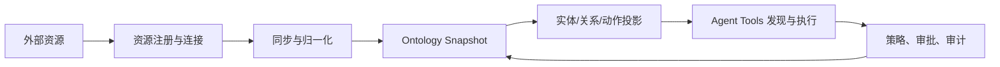

UOSE系统是面向企业数据、知识与业务系统的对象语义执行平台。它把外部资源中的模型、表、字段、指标、实体、服务、接口与操作，统一转化为可查询、可治理、可执行的本体对象空间，让智能体不再直接面对分散 API、数据库或文档，而是在同一套语义契约中完成发现、规划、模拟、执行与审计。

**使用系统：**[进入 UOSE](https://data.xpertai.cn/)

## 核心问题

企业内部的数据与系统通常有四类割裂：

- 资源割裂：BI 语义模型、SAP OData、知识库、数据库、业务 API 各自有不同协议。
- 语义割裂：同一个业务对象在不同系统里有不同名称、字段、粒度和约束。
- 执行割裂：查询、写入、审批、回放和审计分布在不同链路。
- 智能体割裂：Agent 容易直接拼 SQL、拼接口参数或凭自然语言猜测业务含义。

UOSE系统的产品目标是把这些割裂收敛成统一对象空间：对象有类型、属性、关系、约束、动作和证据；动作有输入契约、风险等级、策略判定和审计结果。

## 统一对象语义执行

UOSE 是 Unified Object-Semantic Execution 的产品化实现。它强调三个统一：

- Object：把外部资源中的可识别对象转为实体实例，例如 `semantic_cube`、`sap_odata_entity_set`、`knowledge_entity`、`database_table`。
- Semantic：把对象之间的业务关系、字段含义、别名、约束和上下文沉淀为 ontology snapshot。
- Execution：把对象可执行能力转为 action，例如 `semantic_model.query_cube_slice`、`sap_odata.read_collection`、`database.query_select`。

因此，UOSE系统不是单纯的数据目录，也不是单纯的工具调用网关。它的核心价值在于：让资源接入后自动具备语义可见性、动作可发现性、执行可控性和结果可追溯性。

## 产品闭环

一个典型闭环包含：

1. 管理员注册资源并配置连接密钥和 capabilities。
2. 系统同步外部资源元数据，生成 canonical ontology IR。
3. 本体层发布 snapshot，并投影为实体、关系和动作实例。
4. Agent 通过 `queryEntities`、`getEntityNeighborhood` 和 `discoverActions` 获取最小必要上下文。
5. Agent 在执行前先 `simulateAction`，通过策略和参数校验后再 `executeAction`。
6. 系统记录审计；高风险动作按策略进入审批队列。

## 产品边界

UOSE系统负责外部资源的语义化、可执行化和治理化，但不替代源系统本身：

- 不复制源系统的业务所有权。
- 不绕过源系统权限、认证和并发控制。
- 不要求所有资源一开始都建成重本体。
- 不让 Agent 自由调用任意后端接口。

它提供的是企业智能体访问资源的统一控制面和执行面。
